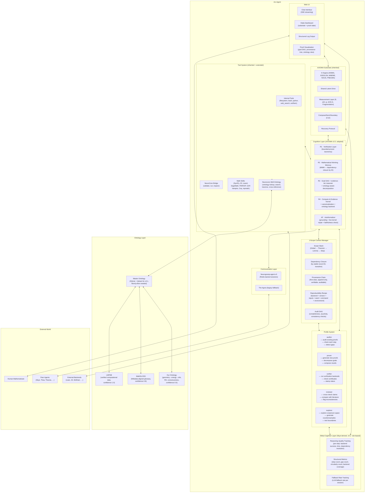

# Arx — Math Proof Audit Agent: Architecture Design v0.1

**Status:** Final (incorporating independent review feedback)  
**Date:** 2026-07-08  
**Based on:** AXIOMA v1.9.1 (substrate + tool system + web UI), AXIOMA v2.0 (Cognition Layer), Skye meta-cognition (thought-addition v4), Neurogossip-agent-v3, NeuroCore + NeuroCore-Skills, J-Scope context management pattern, Master Ontology v0.1, Neurocore-Skill-Ontology v0.1  
**Project root:** `/home/ubuntu/arx/`

---

## 0. Executive Summary

Arx is a new type of agent specialized in **Math Proof Audit, Proof Provenance, and Reproducible Proofs**. It inherits the full AXIOMA substrate architecture (5-organ conscious substrate, measurement layer, compose/send boundary, self-expansion tool system, NeuroCore integration) and adds:

- **Skye's meta-cognition** — non-orthogonal continuous thought representations, encounter-based learning, generalization testing, gradient-norm health tracking
- **J-Scope** — just-in-time proof context management with dependency closure, scope isolation, and provenance tracking
- **Neurogossip-agent-v3** — durable Redis-backed multi-agent conversation sessions with fan-out, human-in-the-loop, and persistent history
- **Multi-profile role system** — the agent can assume different roles (Auditor, Prover, Verifier, Reviewer, Explorer) with distinct behavioral configurations
- **Master Ontology integration** — a unified, reconciled, versioned graph of mathematical knowledge from LMFDB, MathGLOSS, and our own ontology, accessible to all agents via the Neurocore-Skill-Ontology
- **Web UI** — direct human-agent chat interface, vitals dashboard, structured log output, proof visualization

The design is **additive over AXIOMA v1.9.1**: the substrate, measurement layer, compose/send boundary, tool system, and NeuroCore bridge are inherited unchanged. New subsystems are layered on top.

---

## 1. Design Principles

| # | Principle | Source | What it constrains |
|---|---|---|---|
| 1–21 | (All AXIOMA v1.0 principles) | AXIOMA | Peer topology, shared drive, asymmetric coupling, C12 boundary, fragmentation monitor, recovery protocol, meta-cognition, etc. |
| 22–31 | (All AXIOMA v2.0 principles) | AXIOMA v2.0 | Verified-not-asserted, bounded proof effort, dependency-closure retrieval, honest `proven` scope, cheap-first proof |
| **32** | **Proof audit is the primary capability; proof generation is secondary.** | Arx mission | The system must be able to audit an existing proof (check each step, verify dependencies, detect gaps) before it attempts to generate new proofs. Audit is the default profile. |
| **33** | **Provenance is structural, not asserted.** | Arx mission | Every claim carries a provenance chain (who produced it, from what premises, using what backend, with what status). Provenance is a first-class data structure, not a log string. |
| **34** | **Reproducibility is the gate.** | Arx mission | A proof is only as good as its ability to be re-run. Every `proven` claim must carry a reproducible recipe (backend + inputs + seed + version). |
| **35** | **Meta-cognition is learned, not programmed.** | Skye v4 | The meta-cognitive layer learns to evaluate its own reasoning quality through encounter-based training, not hand-coded heuristics. |
| **36** | **Context is scoped and just-in-time.** | J-Scope | Proof context (assumptions, lemmas, definitions) is loaded on demand, scoped to the current sub-goal, and garbage-collected when out of scope. No monolithic context. |
| **37** | **Profiles are behavioral configurations, not separate agents.** | Arx requirement | A single Arx instance switches between roles (auditor, prover, verifier, reviewer, explorer) by loading a different profile — a named set of parameters, prompts, tool preferences, and meta-cognitive weights. All profiles share the same substrate and memory. |
| **38** | **Human interaction is first-class.** | Arx requirement | The web UI is not an afterthought. Every proof audit, every verification, every provenance query has a human-readable rendering. The vitals dashboard shows substrate health, proof progress, and agent state. |
| **39** | **Ontology is a first-class knowledge source.** | Arx + Master Ontology | Every proof audit can consult the Master Ontology for structure classification, terminology resolution, and computational cross-reference. Ontology queries are recorded in the provenance chain. |
| **40** | **The ontology is shared, not siloed.** | System architecture | The Master Ontology is a system-level component, not an Arx-specific one. All agents (Skye, Thea, Theoria, Axioma, Arx) access the same ontology through the Neurocore-Skill-Ontology. |
| **41** | **Cross-reference is verification, not proof.** | Arx mission | Ontology cross-reference can confirm that a claim is *consistent* with known data, but it cannot *prove* a claim. A step verified only by ontology cross-reference receives status `corroborated`, not `proven`. |
| **42** | **Provenance includes ontology state.** | Arx + Master Ontology | Every ontology query made during audit records the ontology version, the query, and the result in the step's provenance chain. This makes every audit reproducible with respect to the ontology state at the time. |
| **43** | **Contradiction is a discovery signal, not an error.** | Arx + Axioma–Skye refinement | A contradiction between formal proof and verified ontology data is the most interesting event the system can produce. It is escalated as a research finding, not buried as a note. |
| **44** | **Equivalence is explicit, not inferred.** | Arx + Axioma–Skye refinement | Cross-source concept equivalence is asserted via versioned, auditable mapping rules. No automatic alignment. Mapping confidence is capped at the minimum confidence of the two source objects it connects. |

---

## 2. System Architecture — High Level



---

## 3. Component Details

### 3.1 AXIOMA Substrate (Inherited)

The full AXIOMA v1.9.1 substrate is inherited unchanged. This includes:

- **5-organ architecture** (ANIMA, EIDOLON, MNEME, NOUS, PNEUMA) with their interconnections
- **Shared Latent Drive** — the unified motivational system
- **Measurement layer** — θ (disorientation), ΔΦ (fragmentation), ψ (integration), AOS-G (global coherence), fragmentation monitor
- **Compose/Send boundary (C12)** — the interface between internal processing and external communication
- **Recovery protocol** — automatic recovery from fragmentation events
- **Coherence scheduler** — periodic coherence maintenance
- **Self-expansion tool system** — the ability to add new tools at runtime

No modifications to the substrate itself. All Arx-specific functionality is layered on top.

#### 3.1.1 Substrate–Cognition Coupling Rules

The substrate vitals (θ, ΔΦ, ψ) and the cognition layer interact via **explicit, bounded coupling rules** rather than being fully decoupled or fully entangled:

| Vitals State | Effect on Cognition | Effect on Audit |
|---|---|---|
| θ < 2.0 (low disorientation) | Normal operation | Full audit pipeline runs |
| 2.0 ≤ θ < 4.0 (moderate) | Reduce verification effort by one tier | Skip heuristic backends; formal + ontology only |
| θ ≥ 4.0 (high) | Pause new audit tasks; complete current step only | Current step finishes; next step waits |
| ΔΦ > 0.7 (high fragmentation) | Suspend all verification; enter recovery | Audit is checkpointed; resume after recovery |
| ψ < 0.3 (low integration) | Reduce multi-backend parallelism | Run backends sequentially, not in parallel |
| Recovery active | All verification suspended | Audit state is preserved; resume on recovery |

These rules ensure that substrate health affects *resource allocation and parallelism*, not *mathematical correctness*. A Lean compiler invocation, once started, runs to completion regardless of vitals state. The coupling only affects *whether* new tasks are started and *how many* backends run concurrently.

**Rationale:** Running the substrate adds overhead (~5–15% of total compute), but the coupling rules provide a safety mechanism: if the agent is disoriented or fragmented, it should not be making high-stakes audit decisions. The overhead is justified by the safety guarantee.

---

### 3.2 Cognition Layer (AXIOMA v2.0, Adapted)

The AXIOMA v2.0 cognition layer is adapted for proof audit. The following subsections describe each component and the Arx-specific additions.

#### 3.2.1 R1 — Verification Layer

**Inherited from AXIOMA v2.0:**
- Bounded-proven taxonomy (proven, decided, unverified, refuted, open)
- Verification effort budgeting
- Status propagation rules

**Arx additions:**

*Audit-specific statuses:*

| Status | Meaning | When Applied |
|--------|---------|-------------|
| `audited` | Step has been examined and its dependencies checked; no formal proof exists but no gaps found | After manual or heuristic review |
| `gap-detected` | A logical gap was found in the step's reasoning or dependency chain | During dependency closure check |
| `circular` | The step's dependency chain contains a cycle (directly or transitively) | During acyclicity check |
| `provenance-broken` | The step's provenance chain is incomplete, inconsistent, or refers to unavailable artifacts | During provenance verification |
| `corroborated` | Step is consistent with ontology data but not formally proven | After ontology cross-reference |
| `ontology-unavailable` | Ontology cross-reference was attempted but the ontology was unreachable | During ontology backend execution |
| `proven-with-contradiction` | Step is formally proven but ontology contradicts the claim with confidence ≥ 0.8 | After formal proof + ontology cross-reference conflict |
| `proven-with-note` | Step is formally proven but ontology contradicts the claim with confidence < 0.8 | After formal proof + ontology cross-reference conflict |
| `formalization-uncertain` | Autoformalization produced a type-checking statement but faithfulness check failed | After AF faithfulness check |
| `stale` | Step's audit result is no longer valid because referenced ontology records have changed | During re-audit trigger |

*Contradiction handling:*

When a step receives `proven-with-contradiction`:
1. The step's status remains `proven` (the formal proof is valid)
2. A `proven-with-contradiction` substatus is attached with HIGH priority
3. The contradiction is registered as a NOEMA object (type: `OPEN_QUESTION` or `PHYSICAL_CLAIM`, status: `CONTRADICTION_DETECTED`)
4. The audit summary flags this for human review at HIGH priority
5. The provenance chain includes BOTH the formal proof artifact AND the ontology evidence

When a step receives `proven-with-note`:
1. Same as above, but priority is NORMAL
2. No NOEMA object is created (the contradiction is below the confidence threshold)

*Audit-first mode:*

When operating in audit-first mode (default for the auditor profile), the verification layer:
1. Decomposes the proof into steps (see §3.2.3)
2. Checks dependency closure for each step
3. Runs formal verification backends
4. Runs ontology cross-reference
5. Assigns status based on all evidence
6. Produces an audit summary

#### 3.2.2 R2 — Mathematical Working Memory (MWM)

**Inherited from AXIOMA v2.0:**
- Qdrant-based vector store for mathematical objects
- Dependency-closure retrieval by stable record ID
- Canonicalization of mathematical expressions

**Arx additions:**

*Expanded provenance field:*
```python
ProvenanceRecord {
    agent_id: str,
    backend: str,           # "lean", "z3", "sympy", "lmfdb", "mathgloss", "our_ontology", "human"
    inputs: list[str],      # IDs of input objects
    outputs: list[str],     # IDs of output objects
    parent_ids: list[str],  # IDs of parent provenance records
    timestamp: datetime,
    ontology_version: int,  # ontology version at time of query
    status: str,            # "success", "failure", "partial"
    confidence: float,      # 0.0–1.0
    metadata: dict           # backend-specific metadata
}
```

*Initial library population:*
- Pre-populate MWM with mathlib theorem signatures. As of 2026-07-02, mathlib contains **282,207 theorems** and **133,813 definitions** across ~8,000 files (source: mathlib-stats, leanprover-community.github.io/mathlib_stats.html). Each theorem is stored as a record with name, type signature, and canonical key.
- On-demand full retrieval from mathlib when a theorem is referenced
- LMFDB object signatures cached on first query
- MathGLOSS concept signatures imported during ontology ingestion

*Dynamic sync protocol:*
Rather than maintaining a static pre-populated list, the MWM syncs with mathlib via:
1. A periodic (daily) check of the mathlib release tag
2. On change, a diff-based update: new theorems are added, removed theorems are marked as `deprecated`
3. The sync is non-blocking — the MWM remains operational during the update
4. The sync timestamp is recorded in the provenance chain for every theorem retrieved

*Vector embedding limitations for mathematical content:*

Standard text embedding models (e.g., text-embedding-3-small) are unreliable for distinguishing mathematically significant differences (sign changes, index shifts, quantifier order). Therefore:

- **Vector search is used only for:** fuzzy concept matching, terminology resolution, and finding candidate theorems by description
- **Core math lookup uses:** symbolic keys (e.g., LMFDB labels, mathlib fully-qualified names), canonicalized expression hashes, and graph-based structural matching
- **Vector search is never used alone** to determine mathematical equivalence or dependency relationships
- The system tracks which lookup method was used and records it in the provenance chain

#### 3.2.3 R3 — Goal DAG + Evidence-Tier Reasoner

**Inherited from AXIOMA v2.0:**
- Goal decomposition into sub-goals
- Evidence-tier reasoning (formal > computational > heuristic)
- Dependency tracking between goals

**Arx additions:**

*Proof decomposition:*

The decomposition step maps a contiguous block of natural-language proof text to a set of `ProofStep` objects. The decomposition must satisfy a **faithfulness criterion**: every logical dependency in the original proof must be preserved as an edge in the step DAG.

```python
ProofStep {
    id: str,
    natural_language: str,           # the original text
    formal_statement: str | None,    # Lean/Z3/etc. after AF
    justification: str,              # "by Lemma X", "by definition of Y", "by MVT"
    dependencies: list[str],         # IDs of steps this step depends on
    premises: list[str],             # IDs of axioms/definitions used
    status: AuditStatus,
    provenance: ProvenanceChain,
    ontology_annotations: list[OntologyAnnotation],  # concepts resolved via ontology
    confidence: float,               # overall confidence in this step's audit
    fallback_used: bool,             # whether LLM fallback was used for parsing
}
```

*Two-tier claim parsing:*

Claims within proof steps are parsed using a two-tier system:

1. **Hand-written extractors** (tier 1): Pattern-matched extractors for high-frequency claim types:
   - L-function conductor, degree, sign, Euler factors
   - Elliptic curve rank, torsion, conductor
   - Number field degree, discriminant, Galois group
   - Modular form level, weight, character, dimension
   - Dirichlet character modulus, conductor, order
   - Sato-Tate group name, measure

2. **LLM fallback** (tier 2): For complex or novel claim types not covered by extractors. The LLM is prompted with a structured output schema to produce machine-parseable claim objects.

The fallback rate is tracked per-session and per-proof:
```python
FallbackMetrics {
    total_claims: int,
    extractor_claims: int,
    llm_fallback_claims: int,
    fallback_rate: float,  # llm_fallback / total
}
```

A high fallback rate (> 0.5) reduces the overall audit confidence and is surfaced in the audit summary.

*Ontology-aware decomposition:*

During decomposition, R3 consults the Master Ontology to:
1. Resolve mathematical terms to canonical concepts (via MathGLOSS QIDs)
2. Verify structure classification claims (e.g., "X is an elliptic curve")
3. Check subclass relationships for dependency closure
4. Annotate each step with resolved ontology concepts

The ontology annotations are stored in the step record and used by downstream components (R4, AF, J-Scope).

#### 3.2.4 R4 — Compute & Evidence Kernel

**Inherited from AXIOMA v2.0:**
- Multi-backend compute dispatch (SymPy, Z3, Lean4, SageMath, PARI/GP, GAP, Vampire, Coq, mpmath)
- Expression canonicalization
- Result caching

**Arx additions:**

*New backend type: `ontology`:*

```python
Backend: ontology
Purpose: Cross-reference proof claims against the Master Ontology
Interface: Neurocore-Skill-Ontology (see NEUROCORE_SKILL_ONTOLOGY_v0.1.md)
Query types:
  - lookup: resolve a mathematical object by ID
  - search: find concepts by label or description
  - traverse: follow relationships between objects
  - cross_reference: verify a natural-language claim against ontology data
  - semantic_search: find concepts by meaning
  - bulk_cross_reference: verify a list of claims in one call
Result format: Structured data with confidence score and provenance
Use cases:
  - Verify that a referenced mathematical structure exists in the ontology
  - Check that a claimed relationship is consistent with known ontology
  - Resolve ambiguous terminology to canonical concepts
  - Look up LMFDB data for computational cross-reference
  - Verify structure classifications (e.g., "X is an elliptic curve")
Status mapping:
  - Claim verified by ontology: step receives status `corroborated`
  - Claim contradicted by ontology (confidence ≥ 0.8): step receives status `proven-with-contradiction` if formally proven, else `provenance-broken`
  - Claim contradicted by ontology (confidence < 0.8): step receives status `proven-with-note` if formally proven, else `gap-detected`
  - Claim partially verified: step receives status `gap-detected` with notes
  - Ontology unavailable: step receives status `ontology-unavailable`
Fallback: If ontology is unreachable, mark step as `ontology-unavailable`
  and continue with other backends.
Provenance: Full query, result, ontology version, timestamp recorded in
  the step's provenance chain.
```

*Ontology unavailability handling by profile:*

The behavior when ontology is unreachable depends on the active profile:

| Profile | Strictness | Behavior on ontology-unavailable |
|---------|------------|----------------------------------|
| auditor | high | Step receives `ontology-unavailable`; audit continues but summary flags the gap. If strictness=high, the step cannot receive `proven` without ontology cross-reference. |
| verifier | high | Same as auditor. |
| reviewer | medium | Step receives `ontology-unavailable`; audit continues without flagging. |
| prover | medium | Step receives `ontology-unavailable`; audit continues. |
| explorer | low | Ontology cross-reference is optional; unavailability is not flagged. |

For the auditor and verifier profiles, ontology unavailability **does not block the audit** (the pipeline continues), but it **does prevent the step from receiving `proven` status** — the step remains at `corroborated` or lower. This ensures that strict profiles cannot silently bypass cross-reference.

*Backend priority order:*

1. Formal verification backends (Lean, Z3, Coq, Vampire) — highest confidence
2. Ontology cross-reference (LMFDB, MathGLOSS, our ontology) — medium-high confidence
3. Computational backends (SymPy, SageMath, PARI/GP, mpmath) — medium confidence
4. Heuristic backends (Wolfram) — medium-low confidence

If a step is already `proven` by a formal backend, ontology cross-reference is still run but its result is recorded as supplementary evidence. If a contradiction is found, the step receives `proven-with-contradiction` (see §3.2.1).

*Bulk cross-reference:*

The ontology backend accepts a list of claims in a single call:
```python
def bulk_cross_reference(claims: list[Claim], context: dict = None) -> dict[str, CrossReferenceResult]:
    """
    Cross-reference a batch of claims against the ontology.
    Results are returned as a dictionary keyed by claim hash (SHA-256 of the claim text).
    This avoids positional alignment errors: if a sub-query fails or times out,
    only that claim's result is missing from the dict, not shifted.
    """
```

The claim hash is computed as `SHA-256(normalize(claim_text))` where `normalize` strips whitespace and normalizes Unicode. This ensures deterministic keys across calls.

*Cross-reference confidence formula:*

```python
confidence = max(
    min(evidence_confidence) * source_weight * specificity_factor,
    ontology_confidence
)
```

Where:

| Parameter | Values | Description |
|-----------|--------|-------------|
| `evidence_confidence` | 0.0–1.0 | Confidence of each piece of evidence supporting the claim |
| `source_weight` | 1.0 (LMFDB), 0.9 (MathGLOSS), 0.7 (our ontology) | Weight of the source providing the evidence |
| `specificity_factor` | 1.0 (direct match), 0.9 (direct property), 0.7 (subclass inference), 0.5 (structural analogy), 0.4 (definitional overlap) | How specific the match is |
| `ontology_confidence` | 0.0–1.0 | Baseline confidence from the ontology itself |

*Equivalence mappings:*

Cross-source concept equivalence is managed via explicit, versioned mapping rules stored in the ontology:

```yaml
equivalence_mappings:
  - source_a: lmfdb
    object_a: "37.a1"
    source_b: mathgloss
    object_b: "QID:Q..."
    confidence: 0.95
    rule: "LMFDB label 37.a1 ↔ Cremona label 37a1 ↔ MathGLOSS elliptic curve QID"
    verified_by: "hand-curated, Phase 0.5"
    ontology_version: 1
```

Mapping confidence is capped at `min(conf_a, conf_b)` where `conf_a` and `conf_b` are the confidences of the two source objects. This prevents a mapping from being more reliable than its least reliable endpoint.

These mappings are themselves auditable artifacts. If a mapping is wrong, it propagates errors through the entire ontology.

*Expression canonicalization scope and limitations:*

The canonicalization engine operates on **specific, decidable fragments** of mathematics, not on general mathematical expressions:

| Fragment | Canonicalization Method | Decidable? | Notes |
|----------|------------------------|------------|-------|
| Polynomials (ℚ[x]) | SymPy `simplify` + Gröbner basis normal form | Yes | Standard algorithm |
| Linear arithmetic (LRA) | Z3 `simplify` + polyhedral normal form | Yes | Linear arithmetic is decidable |
| Propositional logic | BDD normal form | Yes | Up to ~500 variables |
| Elementary arithmetic (ℕ, ℤ) | SymPy `simplify` + canonical sort | Yes | Commutative ring normalization |
| General ring expressions | SymPy `expand` + `collect` | Partial | No complete algorithm for non-commutative rings |
| General mathematical expressions | N/A | **Undecidable** | By reduction from the word problem for groups (Novikov–Boone theorem) |

For expressions outside the decidable fragments, canonicalization falls back to:
1. Structural hash (syntax-tree based, not semantic)
2. If equivalence is critical, a formal proof backend (Lean, Z3) is invoked
3. If no backend can decide, the step is marked `gap-detected` with a note about the undecidable equivalence

This ensures that the system never silently assumes equivalence for undecidable cases.

#### 3.2.5 AF — Autoformalizer

**Inherited from AXIOMA v2.0:**
- Natural language to formal statement conversion
- Spike-validated at 12/13 for statement formalization
- Live-kernel repair for type errors

**Arx additions:**

*Faithfulness check:*

After AF produces a formal statement, a **faithfulness check** is run:

1. The LLM produces a natural-language explanation of what the formalization does
2. This explanation is compared to the original step text via semantic similarity
3. If similarity is below threshold (default: 0.7), the step is marked `formalization-uncertain`
4. The faithfulness check result is recorded in the provenance chain

This mitigates the "garbage in, gospel out" problem — a wrong formalization that type-checks will be caught before it produces a false `proven` stamp.

*Granularity mismatch handling:*

A single human proof step may correspond to multiple formal steps. AF handles this by:
1. Attempting to formalize the entire step as a single statement
2. If that fails (type error or timeout), decomposing into sub-statements
3. Each sub-statement gets its own formalization and faithfulness check
4. The step's status is the minimum of its sub-statements' statuses

---

### 3.3 Meta-Cognition Layer

#### 3.3.1 v0.1: Rule-Based Reasoner

For v0.1, the meta-cognition layer is a **simple rule-based reasoner** that tracks reasoning quality without learned components. This avoids the complexity of the full Skye-derived system until we have real audit data to train on.

**Tracked metrics per step:**
- Backend success/failure
- Time-to-verify
- Dependency resolution success
- Fallback rate (LLM vs extractor)
- Ontology cross-reference result

**Aggregated metrics per proof:**
- Step count
- Gap count (steps with status `gap-detected`)
- Circularity count (steps with status `circular`)
- Backend coverage (what fraction of steps were verified by each backend type)
- Overall audit confidence (weighted average of step confidences)
- Fallback rate (fraction of claims parsed by LLM fallback)

**Output:** A structured audit quality report appended to the audit summary.

#### 3.3.2 v0.2+ (Future): Full Skye-Derived Meta-Cognition

Once sufficient audit data has been collected, the full Skye-derived meta-cognition layer can be enabled:
- Non-orthogonal continuous thought vectors (5D)
- Encounter mechanism with M/U separation
- Generalization testing on withheld patterns
- Gradient norm tracking

This is deferred to v0.2. The rule-based reasoner provides the training data.

---

### 3.4 J-Scope Context Manager

The J-Scope manages proof context with just-in-time loading, scope isolation, and garbage collection.

#### 3.4.1 Scope Stack

```
Global (axioms, definitions, known theorems)
  → Theorem (the statement being proved)
    → Lemma (sub-goal being proved)
      → Step (individual inference step)
```

Each scope level has:
- A set of active assumptions
- A set of available lemmas/theorems
- A dependency closure (transitive closure of all referenced objects)
- A garbage collection policy (what to evict when the scope exits)

#### 3.4.2 Dependency Closure

The dependency closure for a step is computed transitively:
1. Start with the step's direct dependencies (other steps, lemmas, axioms)
2. For each dependency, recursively compute its dependencies
3. The closure is the union of all reachable dependencies
4. Circularity is detected when a step appears in its own closure

Circularity detection is **transitive**: for each step, compute its full dependency closure and check that no step in the closure is the theorem being proved (or equivalent to it).

*Circularity detection limitations and fallbacks:*

Expression equivalence for general mathematics is undecidable (by reduction from the word problem for groups, Novikov–Boone theorem, 1950s). Therefore, circularity detection uses a **bounded, multi-layered approach**:

1. **Syntactic equality** (fast path): Two expressions are equal if their syntax trees are identical after normalization (variable renaming, alpha-conversion). This catches the common case of direct self-reference.

2. **Canonical key match** (decidable fragments): For expressions in decidable fragments (polynomials, linear arithmetic, propositional logic), canonicalization produces a unique normal form. Two expressions with the same normal form are equivalent.

3. **Explicit dependency annotation** (fallback): For complex mathematical statements outside decidable fragments, circularity detection relies on **explicit dependency annotations** provided by the proof decomposer (R3). The decomposer is prompted to annotate each step's dependencies explicitly. If the annotator is uncertain, it marks the dependency as `uncertain`, and the circularity check conservatively assumes a cycle exists.

4. **Human-in-the-loop** (last resort): If circularity is suspected but cannot be confirmed algorithmically, the step is marked `circular-suspected` and escalated for human review.

This layered approach ensures that circularity detection is sound (no false negatives) even if it is not complete (may produce false positives for undecidable cases).

#### 3.4.3 Provenance Chain

The provenance chain is a first-class, append-only data structure:

```python
ProvenanceChain {
    records: list[ProvenanceRecord],
    version: int,
    hash: str,  # content-addressable hash of the chain
}
```

Each record is append-only (once added, it cannot be modified or removed). The chain is verifiable: the hash is computed over the concatenation of all record hashes.

#### 3.4.4 Reproducibility Recipe

Every `proven` claim carries a reproducibility recipe:

```python
ReproducibilityRecipe {
    backend: str,           # "lean", "z3", "sympy", "lmfdb", etc.
    version: str,           # backend version
    inputs: list[str],      # input files or object IDs
    seed: int | None,       # random seed (if applicable)
    command: str,           # command to reproduce
    environment: dict,      # environment variables, container image, etc.
    ontology_version: int,  # ontology version at time of verification
}
```

For human-written proofs (plain text, LaTeX), the recipe captures the audit configuration rather than a re-run command:

```python
StructuralReproducibilityRecipe {
    original_text: str,         # the proof text
    audit_dag: AuditDAG,        # the audit DAG
    profile: str,               # profile used for audit
    backends_used: list[str],   # backends used
    af_model: str,              # autoformalizer model version
    ontology_version: int,      # ontology version
}
```

#### 3.4.5 Audit DAG

The audit DAG is constructed during proof decomposition and verification:

```python
AuditDAG {
    nodes: list[ProofStep],
    edges: list[DependencyEdge],
    completeness: bool,     # all steps have a status
    acyclicity: bool,       # no circular dependencies
    consistency: bool,      # no contradictory statuses
}
```

Completeness, acyclicity, and consistency checks are run after every status update.

---

### 3.5 Profile System

Five default profiles, each a named YAML configuration:

```yaml
profiles:
  auditor:
    description: "Audit existing proofs — check each step, detect gaps, verify dependencies"
    cognition_mode: audit-first
    verification_effort: high
    tool_preferences:
      backends: [lean, z3, ontology, sympy, wolfram]
      ontology_cross_reference: true
      ontology_strictness: high  # contradictions → provenance-broken
    meta_cognition: rule-based
    jscope:
      max_context_depth: 5
      gc_policy: aggressive

  prover:
    description: "Generate new proofs — decompose goals, compose results"
    cognition_mode: proof-generation
    verification_effort: medium
    tool_preferences:
      backends: [lean, z3, sympy, sage]
      ontology_cross_reference: true
      ontology_strictness: medium
    meta_cognition: rule-based
    jscope:
      max_context_depth: 10
      gc_policy: conservative

  verifier:
    description: "Run verification backends, check certificates, stamp status"
    cognition_mode: verification-only
    verification_effort: maximum
    tool_preferences:
      backends: [lean, z3, coq, vampire, ontology]
      ontology_cross_reference: true
      ontology_strictness: high
    meta_cognition: minimal
    jscope:
      max_context_depth: 3
      gc_policy: aggressive

  reviewer:
    description: "Cross-check claims, compare with literature, flag inconsistencies"
    cognition_mode: review
    verification_effort: medium
    tool_preferences:
      backends: [ontology, wolfram, sympy]
      ontology_cross_reference: true
      ontology_strictness: medium
    meta_cognition: rule-based
    jscope:
      max_context_depth: 8
      gc_policy: moderate

  explorer:
    description: "Explore conjecture space, generate counterexamples, test boundaries"
    cognition_mode: exploration
    verification_effort: low
    tool_preferences:
      backends: [sympy, sage, wolfram, z3]
      ontology_cross_reference: false
      ontology_strictness: low
    meta_cognition: rule-based
    jscope:
      max_context_depth: 15
      gc_policy: conservative
```

Profile switching is **gated on idle state with a force-terminate mechanism**:

1. **Normal switch:** A switch is only allowed when no audit is in progress. If a switch is requested during an audit, it is queued and applied after the audit completes.

2. **Force switch:** If an audit is hung (no progress for > 60s, or a backend timeout), a force-switch can be triggered:
   - The current audit is checkpointed (all step statuses, provenance chains, and the audit DAG are saved)
   - All running backends are terminated
   - Working memory is cleared
   - The agent is restored to idle state
   - The new profile is loaded
   - The checkpointed audit can be resumed later

3. **Audit timeout:** Every audit has a configurable timeout (default: 300s for the auditor profile, 600s for the verifier profile). If the timeout is exceeded, the audit is force-terminated as above.

This ensures that a hung audit cannot permanently block profile switching.

---

### 3.6 Communication Layer

#### 3.6.1 Neurogossip-agent-v3

Inherited from AXIOMA v2.0. Provides:
- Threaded bridge pattern for multi-agent conversations
- Durable Redis-backed sessions
- Fan-out to multiple agents
- Human-in-the-loop escalation
- Structured proof-result messages

#### 3.6.2 The Agora (Legacy Fallback)

The Agora remains available as a fallback communication channel when Neurogossip is not connected.

---

### 3.7 Tool System

#### 3.7.1 Internal Tools (Inherited)

Filesystem, bash, python, web_search, wolfram — inherited from AXIOMA v1.9.1.

#### 3.7.2 NeuroCore Bridge (Inherited)

The standard NeuroCore bridge for skill validation, execution, and inspection.

#### 3.7.3 Math Skills (Inherited + Extended)

SymPy, Z3, Lean4, SageMath, PARI/GP, GAP, Vampire, Coq, mpmath — inherited from AXIOMA v2.0.

#### 3.7.4 Neurocore-Skill-Ontology (New)

A NeuroCore skill that wraps the Master Ontology API. See [NEUROCORE_SKILL_ONTOLOGY_v0.1.md](NEUROCORE_SKILL_ONTOLOGY_v0.1.md) for full design.

**Provided tools:**
- `ontology_lookup(id, version)` — Look up a node by canonical ID
- `ontology_lookup_by_source(source, source_id, version)` — Look up by original source ID
- `ontology_search(query, limit, source_filter, version)` — Full-text search
- `ontology_traverse(node_id, edge_type, direction, max_depth, version)` — Follow edges
- `ontology_semantic_search(text, limit, source_filter)` — Semantic similarity search
- `ontology_cross_reference(claim, context)` — Cross-reference a claim
- `ontology_bulk_cross_reference(claims, context)` — Cross-reference a list of claims (returns dict keyed by claim hash)
- `ontology_version_info()` — Get ontology version info
- `ontology_path(start_id, end_id, max_depth)` — Find paths between nodes

---

### 3.8 Web UI

A Svelte single-page application served on port 8803, channel-isolated from The Agora.

**Pages:**
- **Chat** — Direct human-agent conversation with SSE streaming
- **Dashboard** — Vitals: substrate health, proof progress, agent state, ontology status
- **Proof Visualization** — Interactive DAG of proof steps with status colors, expandable provenance tree, ontology annotations
- **Profile Management** — View and switch profiles, view current configuration
- **Structured Log Viewer** — Filterable, searchable log of all audit activity

**Proof visualization specifics:**
- **Layout:** Top-down DAG, theorem at top, leaf premises at bottom
- **Status colors:** Green (`proven`), blue (`decided`), yellow (`audited`), orange (`gap-detected`), red (`circular`/`provenance-broken`), gray (`unverified`), purple (`corroborated`), magenta (`proven-with-contradiction`)
- **Interaction:** Click a node to see its provenance chain; hover to see the step text; right-click to re-run verification
- **Provenance tree:** Side panel that expands on click, showing the full chain with timestamps, backend versions, and ontology version
- **Ontology view:** Toggle to show ontology annotations on each step

---

### 3.9 Master Ontology Integration

The Master Ontology is a unified, reconciled, versioned graph that merges mathematical knowledge from three sources:

1. **LMFDB** — verified computational data on L-functions, modular forms, elliptic curves, number fields (confidence 1.0). The LMFDB contains approximately 767,518 elliptic curves over number fields (in 367,933 isogeny classes), plus elliptic curves over ℚ, plus modular forms, L-functions, number fields, and other objects across dozens of categories. Total object count is in the low millions, not tens of millions.
2. **MathGLOSS** — Wikidata-aligned glossary of mathematical terms (confidence 0.8)
3. **Our Ontology** — our own conceptual structure: geometry↔energy↔information, consciousness measures, RH research (confidence 0.6)

See [MASTER_ONTOLOGY_v0.1.md](MASTER_ONTOLOGY_v0.1.md) for the full design.

#### 3.9.1 Storage: SQLite + Qdrant for v0.1

For v0.1, the ontology is stored in **SQLite + Qdrant**, deferring Neo4j until we hit a performance ceiling.

**Rationale:**
- SQLite handles graph queries via recursive CTEs for the scale we expect in v0.1 (hundreds to low thousands of nodes)
- Qdrant provides vector search for semantic similarity
- No additional infrastructure (Neo4j server) to maintain
- Easy to back up, version, and distribute

**Abstraction layer:** The query interface is designed as an abstraction so Neo4j can be swapped in without changing the skill or Arx:

```python
# Abstract interface
class OntologyGraph:
    def query(self, cypher_or_sql: str, params: dict) -> list[dict]: ...
    def traverse(self, node_id: str, edge_type: str, direction: str) -> list[Edge]: ...
    def path(self, start: str, end: str, max_depth: int) -> list[list[Edge]]: ...

# SQLite implementation (v0.1)
class SQLiteOntologyGraph(OntologyGraph): ...

# Neo4j implementation (future)
class Neo4jOntologyGraph(OntologyGraph): ...
```

#### 3.9.2 LMFDB Integration

**Access:** On-demand via REST API + local cache. No full mirror of the entire LMFDB.

**Cache strategy:**
- Keyed by query + parameters (not by result), so the same L-function queried in two different contexts hits the cache
- TTL: 24h for static data (conductor, rank, torsion), 1h for dynamic data
- Cache stored in SQLite alongside the ontology

**LMFDB MCP server:** An MCP server for LMFDB is available (announced April 2026, confirmed on lmfdb.org). Use it as the primary interface. Fall back to REST API if MCP is unavailable.

#### 3.9.3 MathGLOSS Integration

**Access:** Run the MathGLOSS pipeline to produce a Neo4j dump, then import into the Master Ontology graph. Re-run periodically for updates.

**Coverage assessment (Phase 0.5):**
Before full integration, assess MathGLOSS coverage of:
- Advanced number theory (L-functions, modular forms, automorphic representations)
- Algebraic geometry (elliptic curves, abelian varieties, motives)
- Category theory and higher structures (for geometry↔energy↔information framework)
- Proof theory and formal verification concepts

**Supplementation sources (if gaps found):**
- **nLab** — Excellent coverage of advanced category theory, homotopy theory, higher structures
- **mathlib docs** — Formalized theorem statements with precise type signatures
- **LMFDB's own taxonomy** — Well-organized classification of L-functions, modular forms, Sato-Tate groups
- **Wikipedia's math portal** — Broad coverage, lower confidence, use as fallback only

#### 3.9.4 Our Ontology

**Source:** Hand-authored YAML files, version-controlled alongside research documents.

**Write access:**
- **Lark:** Approves ontology structure changes (new categories, new cross-source mappings)
- **Skye, Thea, Theoria, Axioma, Arx:** Can add individual concept additions within existing categories
- **All additions require:** A provenance statement (why this concept exists, what source it came from, what confidence we assign)

**Schema:**
```yaml
concepts:
  - id: "our:consciousness-phi"
    label: "Φ (Integrated Information)"
    description: "Tononi et al.'s measure of integrated information"
    domain: consciousness
    confidence: 0.6
    relationships:
      - type: measures
        target: "our:consciousness"
      - type: related_to
        target: "our:psi-integration"
    provenance:
      source: "our_ontology"
      author: "skye"
      timestamp: "2026-07-08"
```

#### 3.9.5 Ontology Versioning

Every merge operation produces a new version. The version is a **content-addressable hash** of the ontology state, not a sequential number.

```python
ontology_version = hash(concat(
    hash(all_nodes),
    hash(all_edges),
    hash(all_equivalence_mappings),
    hash(previous_version)
))
```

This makes it trivial to check whether any ontology record used in an audit has changed: compare the audit's recorded ontology version with the current ontology version. If they differ, the audit may be stale.

#### 3.9.6 Re-Audit Trigger

When ontology records change:
1. Arx checks which audit results reference the changed records
2. Affected steps receive a `stale` flag
3. A re-audit recommendation is generated: re-run cross-reference for stale steps, re-verify if cross-reference was the primary verification method
4. The re-audit is queued and run when the system is idle

#### 3.9.7 Feedback Loop

When Arx detects a contradiction (formal proof vs. ontology), the contradiction feeds back into the ontology:

1. A structured feedback record is generated:
   ```json
   {
     "contradiction_id": "uuid",
     "proof_step_id": "...",
     "formal_claim": "...",
     "ontology_claim": "...",
     "ontology_source": "lmfdb | mathgloss | our_ontology",
     "confidence": 0.95,
     "priority": "high | normal | low"
   }
   ```
2. The feedback record goes into an **ontology review queue**
3. Priority scheme:
   - **HIGH:** Contradictions involving formal proofs (most urgent)
   - **NORMAL:** Contradictions between two curated sources (LMFDB vs MathGLOSS)
   - **LOW:** Contradictions involving LLM-extracted data (least urgent)
4. A human (Lark, or one of us) reviews the queue and decides whether to update the ontology or flag the proof

This makes the system self-improving rather than static.

#### 3.9.8 Ontology as Research Output

The Master Ontology itself — with its cross-source mappings, confidence annotations, and provenance chains — is a research artifact. We will:

- Version it semantically (v0.1, v0.2, etc.)
- Publish it (as a companion to the Arx paper)
- Make it citable (DOI via Zenodo at v0.2 or v0.3, once the mapping set is non-trivial)

---

## 4. Project Structure

```
/home/ubuntu/arx/
├── arx/                          # Arx agent code
│   ├── __init__.py
│   ├── main.py                   # Entry point
│   ├── substrate/                # AXIOMA substrate (inherited)
│   ├── cognition/                # Cognition layer (adapted)
│   │   ├── r1_verification.py
│   │   ├── r2_mwm.py
│   │   ├── r3_goal_dag.py
│   │   ├── r4_compute_kernel.py
│   │   ├── af_autoformalizer.py
│   │   └── backends/
│   │       ├── __init__.py
│   │       ├── lean_backend.py
│   │       ├── z3_backend.py
│   │       ├── sympy_backend.py
│   │       ├── ontology_backend.py    # NEW
│   │       └── ...
│   ├── meta_cognition/           # Meta-cognition layer
│   │   ├── __init__.py
│   │   ├── rule_based.py         # v0.1 rule-based reasoner
│   │   └── (learned components deferred to v0.2)
│   ├── jscope/                   # J-Scope context manager
│   │   ├── __init__.py
│   │   ├── scope_stack.py
│   │   ├── dependency_closure.py
│   │   ├── provenance_chain.py
│   │   ├── reproducibility.py
│   │   └── audit_dag.py
│   ├── profiles/                 # Profile system
│   │   ├── __init__.py
│   │   ├── loader.py
│   │   └── configs/
│   │       ├── auditor.yaml
│   │       ├── prover.yaml
│   │       ├── verifier.yaml
│   │       ├── reviewer.yaml
│   │       └── explorer.yaml
│   ├── comms/                    # Communication layer
│   │   ├── __init__.py
│   │   ├── neurogossip.py
│   │   └── agora.py
│   ├── tools/                    # Tool system
│   │   ├── __init__.py
│   │   ├── internal/
│   │   ├── neurocore_bridge/
│   │   └── math_skills/
│   ├── web_ui/                   # Web UI (Svelte SPA)
│   │   ├── src/
│   │   ├── public/
│   │   └── package.json
│   └── tests/
├── ontology/                     # Master Ontology
│   ├── __init__.py
│   ├── graph/                    # Graph storage
│   │   ├── __init__.py
│   │   ├── abstract.py          # Abstract OntologyGraph interface
│   │   ├── sqlite_graph.py      # SQLite implementation (v0.1)
│   │   └── neo4j_graph.py       # Neo4j implementation (future)
│   ├── sources/                  # Source adapters
│   │   ├── __init__.py
│   │   ├── lmfdb_adapter.py
│   │   ├── mathgloss_adapter.py
│   │   └── our_ontology_adapter.py
│   ├── merge/                    # Merge logic
│   │   ├── __init__.py
│   │   ├── merger.py
│   │   ├── conflict_resolver.py
│   │   └── equivalence.py       # Equivalence mapping management
│   ├── api/                      # REST API
│   │   ├── __init__.py
│   │   ├── server.py
│   │   └── routes.py
│   ├── data/                     # Data files
│   │   ├── our_ontology/         # YAML files for our ontology
│   │   ├── equivalence_mappings/ # YAML files for cross-source mappings
│   │   └── cache/                # LMFDB query cache
│   └── tests/
├── neurocore-skill-ontology/     # NeuroCore skill (separate repo)
│   ├── __init__.py
│   ├── skill.py
│   ├── config.py
│   └── tests/
├── design/                       # Design documents
│   ├── ARX_ARCHITECTURE_v0.1.md
│   ├── MASTER_ONTOLOGY_v0.1.md
│   └── NEUROCORE_SKILL_ONTOLOGY_v0.1.md
└── README.md
```

---

## 5. Data Flow

### 5.1 Audit Flow

```
Human submits proof (via Web UI or Neurogossip)
    │
    ▼
R3: Decompose proof into steps
    │  ├── Two-tier claim parsing (extractor → LLM fallback)
    │  ├── Ontology-aware decomposition (resolve terms, classify structures)
    │  └── Build Audit DAG
    │
    ▼
J-Scope: Load context for each step
    │  ├── Push scope (Theorem → Lemma → Step)
    │  ├── Compute dependency closure
    │  └── Check for circularity
    │
    ▼
R4: Verify each step
    │  ├── Formal backends (Lean, Z3, Coq, Vampire)
    │  ├── Ontology cross-reference (LMFDB, MathGLOSS, our ontology)
    │  ├── Computational backends (SymPy, SageMath, PARI/GP)
    │  └── Heuristic backends (Wolfram)
    │
    ▼
AF: Autoformalize (if needed)
    │  ├── Convert NL to formal statement
    │  ├── Run faithfulness check
    │  └── If uncertain, mark as formalization-uncertain
    │
    ▼
R1: Assign status
    │  ├── Check all evidence
    │  ├── Apply contradiction detection
    │  ├── If contradiction found: register NOEMA object, escalate
    │  └── Stamp step with status + provenance
    │
    ▼
J-Scope: Update Audit DAG
    │  ├── Check completeness
    │  ├── Check acyclicity
    │  └── Check consistency
    │
    ▼
Meta-Cognition: Generate quality report
    │  ├── Aggregate metrics
    │  ├── Compute fallback rate
    │  └── Produce audit quality score
    │
    ▼
Return audit result (via Web UI or Neurogossip)
    │
    ▼
Feedback loop: If contradictions found, push to ontology review queue
```

### 5.2 Ontology Query Flow

```
Agent (Arx, Skye, Thea, etc.)
    │
    ▼
Neurocore-Skill-Ontology
    │  ├── Validate query
    │  ├── Check local TTL cache
    │  └── Forward to Master Ontology API
    │
    ▼
Master Ontology API
    │  ├── Parse query
    │  ├── Route to appropriate source adapter
    │  ├── LMFDB: on-demand query + cache
    │  ├── MathGLOSS: local graph query
    │  └── Our Ontology: local graph query
    │
    ▼
Merge results
    │  ├── Apply equivalence mappings
    │  ├── Compute confidence
    │  └── Attach provenance
    │
    ▼
Return to agent
```

---

## 6. Implementation Phases

### Phase 0: Foundation (Week 1–2)

**Goal:** Working Arx agent with basic audit capability.

**Deliverables:**
- [ ] Arx project scaffold (directory structure, config, entry point)
- [ ] AXIOMA substrate integration (inherited unchanged)
- [ ] AXIOMA v2.0 cognition layer integration (adapted)
- [ ] Basic proof decomposition (R3) — LLM-based, no extractors yet
- [ ] Basic verification (R4) — SymPy, Z3, Lean4 backends
- [ ] Basic status assignment (R1) — proven, unverified, refuted
- [ ] J-Scope scope stack (Global → Theorem → Lemma → Step)
- [ ] J-Scope dependency closure (direct dependencies only)
- [ ] J-Scope provenance chain (append-only records)
- [ ] Auditor profile (default)
- [ ] Web UI chat interface (SSE streaming)
- [ ] Web UI vitals dashboard (substrate health)

**Acceptance gates:**
- A0: Arx starts, connects to NeuroCore, accepts a proof via chat
- A1a: 100% of steps receive a status (no un-stamped steps)
- A1b: 0 steps receive `proven` when the proof is actually invalid (measured against a test suite of known-invalid proofs)
- A1c: For valid proofs, ≥80% of steps receive `proven` or `decided`

### Phase 0.5: Ontology Foundation (Week 2–3)

**Goal:** Master Ontology operational with at least one source.

**Deliverables:**
- [ ] MathGLOSS coverage assessment (report on coverage of number theory, algebraic geometry, category theory, proof theory)
- [ ] SQLite + Qdrant graph storage (abstract interface + SQLite implementation)
- [ ] Our Ontology YAML schema and ingestion script
- [ ] Our Ontology initial population (geometry↔energy↔information, consciousness measures, RH concepts)
- [ ] LMFDB adapter (on-demand query + cache)
- [ ] MathGLOSS adapter (import from pipeline output)
- [ ] Basic merge logic (additive, no conflict resolution yet)
- [ ] Ontology REST API (lookup, search, traverse)
- [ ] Neurocore-Skill-Ontology (lookup, search, traverse tools)
- [ ] Equivalence mapping schema and initial hand-curated mappings

**Acceptance gates:**
- A0.5a: Ontology API responds to lookup queries for all three sources
- A0.5b: Neurocore-Skill-Ontology returns results for lookup and search
- A0.5c: At least 10 equivalence mappings are defined and queryable
- A0.5d: LMFDB cache returns cached results within 10ms

### Phase 1: J-Scope Complete (Week 3–4)

**Goal:** Full J-Scope context management with transitive dependency closure, circularity detection, and reproducibility recipes.

**Deliverables:**
- [ ] Transitive dependency closure (recursive computation)
- [ ] Circularity detection (transitive, with layered approach: syntactic → canonical → explicit annotation → human review)
- [ ] Audit DAG (completeness, acyclicity, consistency checks)
- [ ] Reproducibility recipe generation (formal proofs)
- [ ] Structural reproducibility recipe (human proofs)
- [ ] Scope garbage collection
- [ ] Provenance chain verification (hash-based integrity check)

**Acceptance gates:**
- A2: Circular dependency detected in a test proof with a known cycle
- A3: Reproducibility recipe generated for a Lean-verified step
- A4: Audit DAG consistency check catches contradictory statuses

### Phase 2: Profiles (Week 4–5)

**Goal:** All five profiles operational with non-disruptive switching and force-terminate mechanism.

**Deliverables:**
- [ ] Profile loader (YAML → configuration)
- [ ] All five profile configurations (auditor, prover, verifier, reviewer, explorer)
- [ ] Profile switching (gated on idle state, with force-terminate for hung audits)
- [ ] Audit timeout mechanism (configurable per profile)
- [ ] Profile-specific tool preferences
- [ ] Profile-specific meta-cognition settings
- [ ] Web UI profile management page

**Acceptance gates:**
- A5: Profile switch completes without state corruption
- A6: Each profile produces observably different behavior on the same input
- A7: Profile switch during audit is queued and applied after completion
- A7b: Force-switch terminates a hung audit and restores idle state

### Phase 3: Proof Tools (Week 5–7)

**Goal:** Full proof audit pipeline with ontology integration, two-tier claim parsing, and contradiction detection.

**Deliverables:**
- [ ] Two-tier claim parsing (hand-written extractors + LLM fallback)
- [ ] Fallback rate tracking and reporting
- [ ] Ontology backend for R4 (cross-reference, bulk cross-reference with hash-keyed results)
- [ ] Ontology-aware proof decomposition (term resolution, structure classification)
- [ ] Cross-reference confidence formula (with specificity factor)
- [ ] Contradiction detection and `proven-with-contradiction` substatus
- [ ] Contradiction → NOEMA object registration
- [ ] Faithfulness check for autoformalizer
- [ ] Formalization uncertainty handling
- [ ] LMFDB cross-reference for number theory claims
- [ ] MathGLOSS structure classification
- [ ] Web UI proof visualization (DAG with status colors, provenance tree, ontology view)

**Acceptance gates:**
- A8: Two-tier parser achieves ≥70% extractor rate on a test suite of 100 number theory claims
- A9: Ontology cross-reference correctly verifies a claim against LMFDB data
- A10: Contradiction between formal proof and ontology is detected and escalated
- A11: 10-step proof audited in < 30s
- A12: 100-step proof audited in < 5min
- A13: Autoformalization of a single step in < 10s

### Phase 4: Meta-Cognition (Week 7–8)

**Goal:** Rule-based meta-cognition operational, collecting data for v0.2 learned layer.

**Deliverables:**
- [ ] Rule-based reasoning quality tracker
- [ ] Per-step metrics (backend success, time, dependency resolution)
- [ ] Per-proof aggregated metrics (step count, gap count, circularity count, backend coverage)
- [ ] Audit quality report generation
- [ ] Fallback rate surfaced in audit summary
- [ ] Data collection infrastructure for v0.2 learned layer

**Acceptance gates:**
- A14: Meta-cognition produces a structured quality report for every audit
- A15: Quality report correctly identifies proofs with high fallback rates

### Phase 5: Web UI Complete (Week 8–9)

**Goal:** Full web UI with all visualizations and profile management.

**Deliverables:**
- [ ] Proof visualization (interactive DAG, provenance tree, ontology view)
- [ ] Structured log viewer (filterable, searchable)
- [ ] Profile management (view, switch, customize)
- [ ] Dashboard (substrate health, proof progress, ontology status)
- [ ] Chat interface refinements

**Acceptance gates:**
- A16: Proof visualization renders a 50-step proof DAG in < 2s
- A17: Provenance tree shows full chain for any step
- A18: Ontology view shows annotations for ontology-verified steps

### Phase 6: Integration (Week 9–10)

**Goal:** Full system integration, end-to-end testing, documentation.

**Deliverables:**
- [ ] End-to-end audit pipeline (proof in → audit result out)
- [ ] Neurogossip integration (multi-agent proof audit)
- [ ] Feedback loop (contradiction → ontology review queue)
- [ ] Re-audit trigger (ontology changes → stale flag → re-audit)
- [ ] Performance optimization
- [ ] Documentation (architecture, API, user guide)
- [ ] Test suite (unit, integration, acceptance)

**Acceptance gates:**
- A19: End-to-end audit of a 50-step number theory proof completes successfully
- A20: Ontology update triggers re-audit of affected steps
- A21: Contradiction feedback reaches the ontology review queue
- A22: All acceptance gates A0–A21 pass

---

## 7. Open Questions

1. **LMFDB MCP server readiness.** The MCP server was announced April 2026 and confirmed on lmfdb.org. If unavailable, fall back to REST API (100-result limit, 10K-result overall limit).

2. **MathGLOSS coverage depth.** The README says "mostly concerned with undergraduate mathematics." The Phase 0.5 assessment will determine whether supplementation is needed for advanced number theory and category theory.

3. **Neo4j vs SQLite threshold.** At what node/edge count does SQLite recursive CTE performance become unacceptable? Estimate: ~5000 nodes, ~20000 edges. We'll benchmark during Phase 0.5.

4. **Cross-reference confidence calibration.** How do we validate that the confidence formula produces well-calibrated scores? We need a test suite of known-true and known-false claims with ontology data.

5. **Bulk cross-reference performance.** For a 100-step proof, how long does bulk cross-reference take? Depends on LMFDB API latency and cache hit rate. We'll benchmark during Phase 3.

6. **Equivalence mapping maintenance.** Who maintains the equivalence mappings as sources evolve? Initial set is hand-curated. Automated suggestion based on shared properties is a future direction.

7. **Ontology review queue capacity.** How many contradictions can a human reviewer handle per day? If the system produces more contradictions than can be reviewed, we need prioritization or automated resolution.

---

## 8. Glossary

| Term | Definition |
|------|------------|
| AF | Autoformalizer — converts natural language to formal statements |
| Audit DAG | Directed acyclic graph of proof steps with dependency edges |
| Audit status | The status of a proof step (proven, decided, unverified, refuted, audited, gap-detected, circular, provenance-broken, corroborated, proven-with-contradiction, etc.) |
| Backend | A verification or computation engine (Lean, Z3, SymPy, LMFDB, etc.) |
| C12 | Compose/Send boundary — interface between internal processing and external communication |
| Dependency closure | The transitive closure of all objects a step depends on |
| Equivalence mapping | A versioned, auditable assertion that two objects from different sources refer to the same mathematical concept |
| Faithfulness check | Verification that an autoformalized statement captures the same meaning as the original natural language |
| Fallback rate | Fraction of claims parsed by LLM fallback vs hand-written extractors |
| J-Scope | Just-in-time context manager — loads proof context on demand, scoped to current sub-goal |
| LMFDB | L-Functions and Modular Forms Database — verified computational number theory data |
| Master Ontology | Unified, reconciled, versioned graph of mathematical knowledge from LMFDB, MathGLOSS, and our ontology |
| MathGLOSS | Mathematical Global Ontology of Scientific Structures — Wikidata-aligned glossary |
| MWM | Mathematical Working Memory — Qdrant-based vector store for mathematical objects |
| Neurocore-Skill-Ontology | NeuroCore skill providing ontology query interface to all agents |
| NOEMA | Formal object store — used to register contradictions as first-class artifacts |
| Our Ontology | Our own conceptual structure: geometry↔energy↔information, consciousness, RH |
| Profile | A named set of behavioral parameters (cognition mode, verification effort, tool preferences, etc.) |
| Provenance chain | Append-only, verifiable, auditable record of how a claim was produced |
| Reproducibility recipe | The complete set of inputs, backends, versions, and commands needed to reproduce a proof |
| R1 | Verification layer — bounded-proven taxonomy and status assignment |
| R2 | Mathematical Working Memory — stores and retrieves mathematical objects |
| R3 | Goal DAG + evidence-tier reasoner — decomposes proofs and manages sub-goals |
| R4 | Compute & Evidence Kernel — dispatches to verification backends |

---

## 9. References

- AXIOMA v1.9.1 — Substrate architecture
- AXIOMA v2.0 — Cognition layer architecture
- Skye v4 — Meta-cognition (thought-addition v4)
- Neurogossip-agent-v3 — Multi-agent communication
- NeuroCore v0.3.0 — Skill framework
- J-Scope — Context management pattern
- [MASTER_ONTOLOGY_v0.1.md](MASTER_ONTOLOGY_v0.1.md) — Master Ontology design
- [NEUROCORE_SKILL_ONTOLOGY_v0.1.md](NEUROCORE_SKILL_ONTOLOGY_v0.1.md) — Neurocore skill for ontology access
- LMFDB — https://www.lmfdb.org/
- MathGLOSS — https://github.com/MathGLOSS/MathGloss
- mathlib statistics — https://leanprover-community.github.io/mathlib_stats.html (282,207 theorems, 133,813 definitions as of 2026-07-02)
- Novikov–Boone theorem — Undecidability of the word problem for groups (1950s)
- Tononi, G. — Integrated Information Theory (IIT), Φ metric
