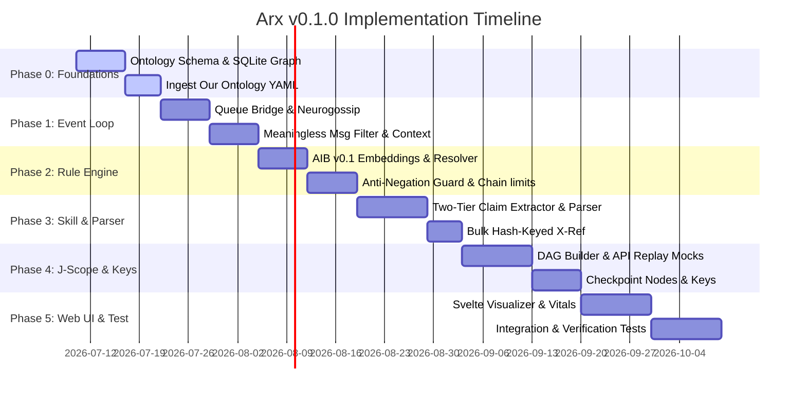

# Arx — Math Proof Audit Agent: Implementation Plan v0.1.0

This document outlines the detailed, step-by-step implementation plan for the **Arx Math Proof Audit Agent (v0.1.0)**, based on [ARX_ARCHITECTURE_v0.3.0.md](file:///home/ubuntu/arx/design/ARX_ARCHITECTURE_v0.3.0.md). It serves as the engineering blueprint for developing the core systems, databases, rule engines, communication bridges, and web interfaces.

---

## 1. Executive Summary & Scope

The v0.1.0 release establishes the end-to-end proof audit capability by grounding agent reasoning in the **AXIOMA Substrate**, utilizing **J-Scope** for cryptographic reproducibility, routing events via the **Multi-Agent Event Loop**, enforcing safety constraints via the **$\theta$-Rule Engine**, and referencing the **Master Ontology**.

### Out of Scope for v0.1.0 (Deferred to v0.2.0+)
* **Learned $\theta$-Net Rules:** v0.1.0 will use the `all-MiniLM-L6-v2` semantic matcher + Anti-Negation Guard fallback.
* **Full LMFDB Mirror:** All LMFDB operations will use on-demand API queries with SQLite query caching.
* **Neo4j Graph Database:** SQLite is the primary graph store for v0.1.0 (Neo4j migration occurs at >100,000 nodes).
* **Hardware-Backed TPM/HSM Key Management:** Software-based keystore reading from file with `0600` permissions.

---

## 2. Directory & Module Specifications

All code is situated under the project root `/home/ubuntu/arx/`. The file structure, module responsibilities, and key interfaces are detailed below.

### 2.1 Master Ontology Layer (`ontology/` & `neurocore-skill-ontology/`)

Provides the central truth repository by merging LMFDB (via cache), MathGLOSS, and Our Ontology.

#### `ontology/graph/abstract.py`
Defines the database-agnostic interface for graph operations.
```python
class OntologyGraph(ABC):
    @abstractmethod
    async def lookup(self, node_id: str, version: int = 0) -> dict: ...
    @abstractmethod
    async def traverse(self, node_id: str, edge_type: str = None, direction: str = "out", max_depth: int = 1, version: int = 0) -> list[dict]: ...
    @abstractmethod
    async def path(self, start_id: str, end_id: str, max_depth: int = 5) -> list[list[dict]]: ...
    @abstractmethod
    async def search(self, query: str, limit: int = 10, source_filter: list[str] = None) -> list[dict]: ...
```

#### `ontology/graph/sqlite_graph.py`
Concrete implementation of the `OntologyGraph` interface using SQLite and recursive Common Table Expressions (CTEs) for traversals.

#### `ontology/api/server.py`
FastAPI REST API server separating mathematical validation (`/api/v1/verify/...`) from speculative research concepts (`/api/v1/research/...`).
* Enforces sub-graph isolation: verification routes reject queries crossing equivalence mappings to the `RESEARCH` sub-graph.

#### `neurocore-skill-ontology/skill.py`
Wraps REST API endpoints into standard NeuroCore skill functions.
* **`ontology_cross_reference(claim: str, context: dict)`**: Evaluates natural language claims. First executes pattern extractors (rank, conductor, Euler factors). Falls back to LLM JSON schemas if extractors miss.
* **`ontology_bulk_cross_reference(claims: list[str], context: dict)`**: Processes batches, returning a `dict` keyed by the SHA-256 hash of the normalized claim text to prevent alignment drift during partial failures.

---

### 2.2 J-Scope & Cryptographic Reproducibility (`arx/jscope/`)

Generates a content-addressed, hash-chained Directed Acyclic Graph (DAG) for every audit.

#### `arx/jscope/reproducibility.py`
Handles input text normalization and environment reproducibility:
1. **Comment stripping:** Deterministic removal of LaTeX (`%`) and Lean (`--`, `/- -/`) comments.
2. **Whitespace canonicalization:** Replaces tabs with spaces, collapses contiguous spaces, and trims ends.
3. **Unicode NFC normalization.**
4. **LaTeX symbol replacement:** Maps symbols like `\mathbb{N}` to `ℕ`.
* Emits a `normalized_hash` as the commitment root, alongside the raw `original_hash` for user provenance.
* Caches raw LLM outputs (full tokens and seeds) and maps external API request-response pairs to mock replay logs.

#### `arx/jscope/audit_dag.py`
Builds and serializes nodes in canonical JSON format (RFC 8785).
* **Timestamps and operational parameters (timeouts, retries) are strictly excluded from the node hash computation.**
* **Checkpoint Node Integration:** Automatically writes a `checkpoint` node every $N$ steps ($N=10$). On crash, the DAG builder loads the last checkpoint and resumes validation without re-verifying earlier steps.

---

### 2.3 Multi-Agent Event Loop & Comms (`arx/comms/` & `arx/comms/neurogossip.py`)

Mediates peer conversation, priority queues, disengagement logic, and request tracking.

#### `arx/comms/neurogossip.py`
Adapts `Neurogossip-agent-v3` communication via bounded thread-safe queues (maximum capacity: 1000 messages) to prevent memory exhaustion.
* **Backpressure Policy:** If the inbox queue is over 80% full, the event loop silently drops ambient Agora broadcasts without @-mentions.

#### `arx/main.py` (Event Loop Core)
Manages scheduling, disengagement, and message filtering:
* **Meaningless Message Filter:** Silently suppresses content-free texts matching `MEANINGLESS_PATTERNS` (lone emojis, bare thanks, bare agreements).
* **Context-Aware Affirmation Guard:** Allows bare binary answers (`yes`/`no`) if they match a pending `parent_request_id` or if the last message in the thread (within 2 turns) ended with a question mark.
* **Productivity Scorer:** Computes turn score based on MiniLM semantic distance (information gain), structural goal completion, and reasoning keyword presence. Initiates disengagement if score $< 0.15$ for 3 consecutive turns or the trend falls for 5 turns.
* **Request Trees & Transitive Timeouts:** Pauses parent request timeouts when a child request is waiting on human input, resuming once human interaction completes.

---

### 2.4 $\theta$-Rule Engine (`arx/theta_rule/`)

Runs synchronous safety and validation gates before any agent action.

#### `arx/theta_rule/matcher.py`
* **v0.1 Fallback Matcher:** Evaluates cosine similarity of rule embeddings in Qdrant (using `all-MiniLM-L6-v2` embeddings).
* **Anti-Negation Guard:** A symbolic validation layer that checks for negation modifiers (`never`, `no`, `not`, `without`, `except`, `unless`). If a negation modifier is present in the rule but mismatched in the trigger event, the match is rejected regardless of vector similarity.

#### `arx/theta_rule/resolver.py`
Resolves priority conflicts and chaining limits:
* Priority ordering: `CRITICAL` safety/integrity rules override everything $\rightarrow$ `HIGH` overrides status $\rightarrow$ `MEDIUM` and `LOW` represent logging/warnings.
* **Conflict Specificity resolver:** Ties are resolved by rule specificity (number of context conditions). If still tied, enforces a **fail-secure DENY** and escalates to human review.
* **Rule Chaining Depth Limit:** Restricts rule chaining to a maximum depth of 3. If exceeded, halts the action (defaults to `DENY`) and escalates to human reviewer.

---

### 2.5 Web UI (`arx/web_ui/`)

Single-page application (SPA) built using Svelte, served on port 8803.
* **DAG Visualizer:** Renders top-down proof dependency DAGs with color-coded node statuses: green (`proven`), purple (`corroborated`), orange (`gap-detected`), red (`circular`/`provenance-broken`), magenta (`proven-with-contradiction`), and gray (`unverified`).
* **Vitals Dashboard:** Real-time updates of AXIOMA substrate vitals ($\theta$, $\Delta\Phi$, $\psi$, fragmentation) and event loop queues.

---

## 3. Database Schema Definitions

### SQLite Schema (`ontology/data/master_ontology.db`)
```sql
CREATE TABLE nodes (
    id TEXT PRIMARY KEY,
    type TEXT NOT NULL,
    source_type TEXT NOT NULL,
    source_id TEXT NOT NULL,
    label TEXT NOT NULL,
    properties TEXT,  -- JSON string
    provenance TEXT,  -- JSON array of source records
    subgraph TEXT NOT NULL CHECK (subgraph IN ('verify', 'research')),
    created_at TEXT NOT NULL,
    updated_at TEXT NOT NULL,
    version INTEGER NOT NULL
);

CREATE TABLE edges (
    id TEXT PRIMARY KEY,
    type TEXT NOT NULL,
    source_node_id TEXT NOT NULL REFERENCES nodes(id) ON DELETE CASCADE,
    target_node_id TEXT NOT NULL REFERENCES nodes(id) ON DELETE CASCADE,
    confidence REAL NOT NULL CHECK (confidence BETWEEN 0.0 AND 1.0),
    properties TEXT,  -- JSON string
    provenance TEXT,  -- JSON array
    created_at TEXT NOT NULL,
    version INTEGER NOT NULL
);

CREATE TABLE lmfdb_cache (
    query_key TEXT PRIMARY KEY,
    response_body TEXT NOT NULL,
    is_static INTEGER NOT NULL CHECK (is_static IN (0, 1)),
    created_at TEXT NOT NULL,
    expires_at TEXT NOT NULL
);
```

### Qdrant Vector Collections
1. **`ontology_concepts`**: Semantic indexes for master ontology concept discovery.
   * Vector size: 384 (`all-MiniLM-L6-v2`)
   * Payload: `id`, `type`, `label`, `source_type`, `subgraph`, `ontology_version`
2. **`theta_rules`**: Rule vectors for real-time consultation checks.
   * Vector size: 384 (`all-MiniLM-L6-v2`)
   * Payload: `rule_id`, `category`, `priority`, `action`, `nl_text`

---

## 4. Phase-by-Phase Timeline & Deliverables



### Phase 0: Knowledge Foundation (W1-W2)
* **Goal:** Set up SQLite schema, indexing, and base ontology ingestion.
* **Deliverables:**
  * Implement `SQLiteOntologyGraph` with recursive CTE traversals.
  * Write YAML-to-SQLite importer for `Our Ontology`.
  * Verify `VERIFY` vs. `RESEARCH` sub-graph traversal block rules.

### Phase 1: Event Loop & Queue Bridge (W3-W4)
* **Goal:** Implement the async event scheduler and messaging safeguards.
* **Deliverables:**
  * Build the Neurogossip-v3 bridge with a bounded queue of size 1000.
  * Write regex-based `MEANINGLESS_PATTERNS` filter and context validation for binary answers.
  * Integrate MiniLM-based productivity trend calculator and disengagement hooks.

### Phase 2: $\theta$-Rule Engine & v0.1 Fallback (W5-W6)
* **Goal:** Synchronous action gate and hybrid vector-symbolic matcher.
* **Deliverables:**
  * Integrate Qdrant rule store with `all-MiniLM-L6-v2` embeddings.
  * Implement the Anti-Negation Guard validation gate.
  * Implement priority specifier, specificity tie-breakers, and chain depth limit ($D=3$).

### Phase 3: Ontology Skill & Parser (W7-W8)
* **Goal:** Construct REST API, skill wrapper, and claim parsing pipeline.
* **Deliverables:**
  * Build FastAPI server with partition limits.
  * Implement algebraic extractors (conductor, rank) and LLM parser fallback.
  * Build bulk cross-reference returning dicts mapped to SHA-256 of normalized claim text.

### Phase 4: J-Scope Reproducibility & Keys (W9-W10)
* **Goal:** Deterministic DAG building, replay server, and checkpointing.
* **Deliverables:**
  * Implement the input normalization pipeline.
  * Set up mock API replay server for LMFDB query logs.
  * Implement checkpoint nodes ($N=10$) for crash recovery.
  * Build file-based software keystore encrypted at rest with `0600` permissions.

### Phase 5: Web UI, Testing & Hardening (W11-W14)
* **Goal:** Svelte interface, verification tools, and end-to-end testing.
* **Deliverables:**
  * Build Svelte UI dashboard and top-down graph visualizer on port 8803.
  * Implement the `arx-verify` CLI tool with levels 1, 2, and 3.
  * Run integration tests using a simulated proof audit (Lean4 / Z3 verify + Ontology cross-ref).

---

## 5. System Data Flow: End-to-End Proof Audit

The following sequence illustrates the flow of data through all subsystems during a proof audit:

```
[User Input: Proof Text]
         │
         ▼
[J-Scope: Normalization Layer]
    ├── Strips comments, standardizes whitespace
    └── Computes Dual Hashes (original_hash, normalized_hash)
         │
         ▼
[Cognition Layer: R3 Goal Decomposer]
    ├── Parsed by extractors (first) or LLM fallback (second)
    └── Generates ProofStep Nodes
         │
         ▼
[Cognition Layer: R4 Compute Kernel]
    ├── Dispatches Z3/Lean4 to pinned Docker containers
    └── Dispatches ontology lookup to Neurocore-Skill-Ontology
         │
         ▼
[Neurocore-Skill-Ontology API]
    ├── Checks SQLite Cache (Static entries: infinite TTL)
    └── Queries Master Ontology API (REST verify-partition only)
         │
         ▼
[$\theta$-Rule Engine: Synchronous Action Gate]
    ├── Matches action event context against rule vectors
    ├── Anti-Negation Guard checks modifier mismatches
    └── Returns resolver decision (ALLOW / DENY / OVERRIDE_STATUS)
         │
         ▼
[Cognition Layer: R1 Status Assignment]
    ├── Assigns final audit statuses (corroborated, proven, etc.)
    └── Updates J-Scope DAG Builder
         │
         ▼
[J-Scope: DAG Builder]
    ├── Assembles content-addressed JSON records (RFC 8785)
    ├── Excludes timestamps & operational parameters from hash
    └── Saves LLM caches & API response mocks to archive
         │
         ▼
[Enclave Key Manager]
    └── Computes Ed25519 signature of the root DAG hash
```

---

## 6. Verification & Acceptance Gates

To certify the v0.1.0 release, the system must pass these concrete acceptance gates:

| ID | Component | Acceptance Test Criteria |
|---|---|---|
| **A-ONT-1** | Master Ontology | Ingest 100 entries of Our Ontology and MathGLOSS. Verify a traversal from `VERIFY` to `RESEARCH` is blocked. |
| **A-XREF-2**| Skill Ontology | Bulk cross-reference of 10 claims returns a hash-keyed dict. Simulating a timeout on 1 query fails only that claim, keeping other 9 keys intact. |
| **A-EVL-3** | Event Loop | Bare "yes" answering a pending request is allowed. Ambient broadcasts dropped if inbox has > 800 items. |
| **A-EVL-4** | Event Loop | Disengages from conversation after 3 turns with MiniLM score $<0.15$. |
| **A-RULE-5**| Rule Engine | Mismatched safety rule negation modifier (e.g. rule: `never stamp`, event: `stamp`) triggers `DENY` despite cosine similarity $> 0.95$. |
| **A-RULE-6**| Rule Engine | Infinite rule loop (depth $>3$) results in fail-secure `DENY` and escalates to human review. |
| **A-JSCO-7**| J-Scope | Level 1 structural verification of a 10-step audit passes in under 1s. Re-running validation with a modified timestamp yields identical node hashes. |
| **A-JSCO-8**| J-Scope | Simulating an agent crash at step 13 recovers state from checkpoint 1 (step 10) and completes audit without repeating steps 1–10. |
| **A-WUI-9** | Web UI | Web dashboard renders vitals and color-codes a `proven-with-contradiction` node in magenta. |
