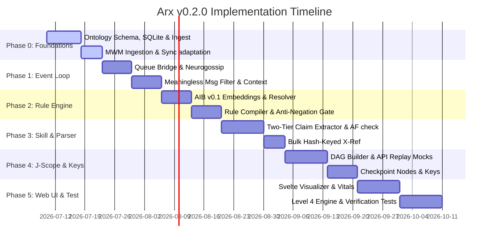

# Arx — Math Proof Audit Agent: Implementation Plan v0.2.0

This document outlines the detailed, step-by-step implementation plan for the **Arx Math Proof Audit Agent (v0.2.0)**, based on [ARX_ARCHITECTURE_v0.3.0.md](file:///home/ubuntu/arx/design/ARX_ARCHITECTURE_v0.3.0.md). This v0.2.0 revision addresses and resolves the six critical architectural gaps identified during the adversarial review of v0.1.0.

---

## 1. Executive Summary & Scope

The v0.2.0 release establishes the end-to-end proof audit capability by grounding agent reasoning in the **AXIOMA Substrate**, utilizing **J-Scope** for cryptographic reproducibility, routing events via the **Multi-Agent Event Loop**, enforcing safety constraints via the **$\theta$-Rule Engine**, and referencing the **Master Ontology**.

This plan details all database schemas, code modules, verification protocols, consensus mechanisms, and timelines required to build the complete, production-ready system.

### Out of Scope for v0.2.0 (Deferred to v0.3.0+)
* **Learned $\theta$-Net Rules:** v0.2.0 will use the `all-MiniLM-L6-v2` semantic matcher + Anti-Negation Guard fallback.
* **Full LMFDB Mirror:** All LMFDB operations will use on-demand API queries with SQLite query caching.
* **Neo4j Graph Database:** SQLite is the primary graph store for v0.2.0 (Neo4j migration occurs at >100,000 nodes).
* **Hardware-Backed TPM/HSM Key Management:** Software-based keystore reading from file with `0600` permissions.

---

## 2. Database Schema Definitions

The Master Ontology uses SQLite as its primary graph store and cache database. It is located at `ontology/data/master_ontology.db`.

```sql
CREATE TABLE nodes (
    id TEXT PRIMARY KEY,
    type TEXT NOT NULL,
    source_type TEXT NOT NULL,
    source_id TEXT NOT NULL,
    label TEXT NOT NULL,
    properties TEXT,  -- JSON string
    provenance TEXT,  -- JSON array of source records
    subgraph TEXT NOT NULL CHECK (subgraph IN ('verify', 'research')),
    created_at TEXT NOT NULL,
    updated_at TEXT NOT NULL,
    version INTEGER NOT NULL
);

CREATE TABLE edges (
    id TEXT PRIMARY KEY,
    type TEXT NOT NULL,
    source_node_id TEXT NOT NULL REFERENCES nodes(id) ON DELETE CASCADE,
    target_node_id TEXT NOT NULL REFERENCES nodes(id) ON DELETE CASCADE,
    confidence REAL NOT NULL CHECK (confidence BETWEEN 0.0 AND 1.0),
    properties TEXT,  -- JSON string
    provenance TEXT,  -- JSON array
    created_at TEXT NOT NULL,
    version INTEGER NOT NULL
);

-- Merging rules and deduplication mappings between LMFDB, MathGLOSS, and Our Ontology
CREATE TABLE equivalence_mappings (
    id TEXT PRIMARY KEY,
    source_a TEXT NOT NULL,
    object_a TEXT NOT NULL,
    source_b TEXT NOT NULL,
    object_b TEXT NOT NULL,
    confidence REAL NOT NULL CHECK (confidence BETWEEN 0.0 AND 1.0),
    rule TEXT NOT NULL,
    verified_by TEXT NOT NULL,
    ontology_version INTEGER NOT NULL
);

-- Version tracking table for content-addressed snapshot hashes
CREATE TABLE version_log (
    version INTEGER PRIMARY KEY AUTOINCREMENT,
    hash TEXT NOT NULL UNIQUE,
    created_at TEXT NOT NULL,
    description TEXT,
    sources_ingested TEXT,  -- JSON array
    node_count INTEGER NOT NULL,
    edge_count INTEGER NOT NULL
);

-- In-memory and local SQLite query cache for LMFDB and external REST queries
CREATE TABLE lmfdb_cache (
    query_key TEXT PRIMARY KEY,
    response_body TEXT NOT NULL,
    is_static INTEGER NOT NULL CHECK (is_static IN (0, 1)),
    created_at TEXT NOT NULL,
    expires_at TEXT NOT NULL
);

-- Indexes for efficient recursive CTE path traversals
CREATE INDEX idx_nodes_type ON nodes(type);
CREATE INDEX idx_nodes_source ON nodes(source_type, source_id);
CREATE INDEX idx_nodes_subgraph ON nodes(subgraph);
CREATE INDEX idx_edges_source_type ON edges(source_node_id, type);
CREATE INDEX idx_edges_target ON edges(target_node_id);
```

### Qdrant Vector Collections
1. **`ontology_concepts`**: Semantic indexes for master ontology concept discovery.
   * Vector size: 384 (`all-MiniLM-L6-v2`)
   * Payload: `id`, `type`, `label`, `source_type`, `subgraph`, `ontology_version`
2. **`theta_rules`**: Rule vectors for real-time consultation checks.
   * Vector size: 384 (`all-MiniLM-L6-v2`)
   * Payload: `rule_id`, `category`, `priority`, `action`, `nl_text`

---

## 3. Directory & Module Specifications

All code is situated under the project root `/home/ubuntu/arx/`. The file structure, module responsibilities, and key interfaces are detailed below.

### 3.1 Master Ontology Layer (`ontology/` & `neurocore-skill-ontology/`)

Provides the central truth repository by merging LMFDB (via cache), MathGLOSS, and Our Ontology.

#### `ontology/graph/abstract.py`
Defines the database-agnostic interface for graph operations.
```python
class OntologyGraph(ABC):
    @abstractmethod
    async def lookup(self, node_id: str, version: int = 0) -> dict: ...
    @abstractmethod
    async def traverse(self, node_id: str, edge_type: str = None, direction: str = "out", max_depth: int = 1, version: int = 0) -> list[dict]: ...
    @abstractmethod
    async def path(self, start_id: str, end_id: str, max_depth: int = 5) -> list[list[dict]]: ...
    @abstractmethod
    async def search(self, query: str, limit: int = 10, source_filter: list[str] = None) -> list[dict]: ...
```

#### `ontology/graph/sqlite_graph.py`
Concrete implementation of the `OntologyGraph` interface using SQLite and recursive Common Table Expressions (CTEs) for traversals.

#### `ontology/api/server.py`
FastAPI REST API server separating mathematical validation (`/api/v1/verify/...`) from speculative research concepts (`/api/v1/research/...`).
* Enforces sub-graph isolation: verification routes reject queries crossing equivalence mappings to the `RESEARCH` sub-graph.

#### `neurocore-skill-ontology/skill.py`
Wraps REST API endpoints into standard NeuroCore skill functions.
* **`ontology_cross_reference(claim: str, context: dict)`**: Evaluates natural language claims. First executes pattern extractors (rank, conductor, Euler factors). Falls back to LLM JSON schemas if extractors miss.
* **`ontology_bulk_cross_reference(claims: list[str], context: dict)`**: Processes batches, returning a `dict` keyed by the SHA-256 hash of the normalized claim text to prevent alignment drift during partial failures.

---

### 3.2 Adapted Cognition Layer (`arx/cognition/`)

Layers specialized proof-handling mechanisms on top of the AXIOMA substrate.

#### `arx/cognition/r1_verification.py`
Manages the step status state machine.
* Implements the propagation of statuses: circular checks, contradictions (structural vs. property-level), and formalization flags.
* Assigns specialized substatuses: `audited`, `gap-detected`, `circular`, `provenance-broken`, `corroborated`, `ontology-unavailable`, `proven-with-contradiction`, `proven-with-note`, `formalization-uncertain`, `stale`.

#### `arx/cognition/r2_mwm.py`
Manages the Mathematical Working Memory (MWM).
* Caches mathlib signatures and matches them via exact symbolic keys and hash indices.
* Embeddings are restricted to fuzzy concept discovery.

#### `arx/cognition/r3_goal_dag.py`
Parses proofs into a dependency DAG.
* Implements the **two-tier parser**: prioritizes hand-written extractors for common claims (conductor, rank) and falls back to LLM JSON schema matching for complex statements.
* Tracks LLM fallback rates per-audit.

#### `arx/cognition/r4_compute_kernel.py`
Dispatches steps to verifier backends.
* Mediates execution of Lean, Z3, SymPy, and the Master Ontology API.
* Implements sequential fallback: runs backends sequentially if ψ < 0.3 (low integration).

#### `arx/cognition/af_autoformalizer.py`
Translates natural-language proof steps into Lean/Z3 code.
* **Faithfulness Check:** Prompts the LLM to generate a natural-language description of its own generated code, then computes a semantic similarity score (using `all-MiniLM-L6-v2`) against the original input. If similarity $< 0.7$, marks the step as `formalization-uncertain`.

---

### 3.3 J-Scope Context & Reproducibility (`arx/jscope/`)

Generates a content-addressed, hash-chained Directed Acyclic Graph (DAG) for every audit.

#### `arx/jscope/scope_stack.py`
Manages nesting scopes (Global $\rightarrow$ Theorem $\rightarrow$ Lemma $\rightarrow$ Step) and performs garbage collection on variables when exiting scope.

#### `arx/jscope/dependency_closure.py`
Computes transitive closures of proof step dependencies.
* **Circularity Checker:** Implements a bounded, multi-layered check (syntactic $\rightarrow$ canonical $\rightarrow$ manual annotations) to detect cycles. If sus, flags as `circular` and halts.

#### `arx/jscope/provenance_chain.py`
Structures and appends audit logs, tool executions, and ontology versions to build the verifiable, non-repudiable provenance record.

#### `arx/jscope/reproducibility.py`
Handles input text normalization and environment reproducibility:
1. **Comment stripping:** Deterministic removal of LaTeX (`%`) and Lean (`--`, `/- -/`) comments.
2. **Whitespace canonicalization:** Replaces tabs with spaces, collapses contiguous spaces, and trims ends.
3. **Unicode NFC normalization.**
4. **LaTeX symbol replacement:** Maps symbols like `\mathbb{N}` to `ℕ`.
* Emits a `normalized_hash` as the commitment root, alongside the raw `original_hash` for user provenance.
* Caches raw LLM outputs (full tokens and seeds) and maps external API request-response pairs to mock replay logs.

#### `arx/jscope/audit_dag.py`
Builds and serializes nodes in canonical JSON format (RFC 8785).
* **Timestamps and operational parameters (timeouts, retries) are strictly excluded from the node hash computation.**
* **Checkpoint Node Integration:** Automatically writes a `checkpoint` node every $N$ steps ($N=10$). On crash, the DAG builder loads the last checkpoint and resumes validation without re-verifying earlier steps.

---

### 3.4 Multi-Agent Event Loop & Comms (`arx/comms/`)

Mediates peer conversation, priority queues, disengagement logic, and request tracking.

#### `arx/comms/neurogossip.py`
Adapts `Neurogossip-agent-v3` communication via bounded thread-safe queues (maximum capacity: 1000 messages) to prevent memory exhaustion.
* **Backpressure Policy:** If the inbox queue is over 80% full, the event loop silently drops ambient Agora broadcasts without @-mentions.

#### `arx/main.py` (Event Loop Core)
Manages scheduling, disengagement, and message filtering:
* **Meaningless Message Filter:** Silently suppresses content-free texts matching `MEANINGLESS_PATTERNS` (lone emojis, bare thanks, bare agreements).
* **Context-Aware Affirmation Guard:** Allows bare binary answers (`yes`/`no`) if they match a pending `parent_request_id` or if the last message in the thread (within 2 turns) ended with a question mark.
* **Productivity Scorer:** Computes turn score based on MiniLM semantic distance (information gain), structural goal completion, and reasoning keyword presence. Initiates disengagement if score $< 0.15$ for 3 consecutive turns or the trend falls for 5 turns.
* **Request Trees & Transitive Timeouts:** Pauses parent request timeouts when a child request is waiting on human input, resuming once human interaction completes.

---

### 3.5 $\theta$-Rule Engine (`arx/theta_rule/`)

Runs synchronous safety and validation gates before any agent action.

#### `arx/theta_rule/compiler.py`
Compiles plain-text English rules into Rule vectors.
* **Round-Trip Validation:** After embedding rules into Qdrant, decodes the vector back to natural language. If the semantic similarity between the original rule and the decoded rule is $< 0.8$, flags the rule as miscompiled and halts deployment.

#### `arx/theta_rule/matcher.py`
* **v0.1 Fallback Matcher:** Evaluates cosine similarity of rule embeddings in Qdrant (using `all-MiniLM-L6-v2` embeddings).
* **Anti-Negation Guard:** A symbolic validation layer that checks for negation modifiers (`never`, `no`, `not`, `without`, `except`, `unless`). If a negation modifier is present in the rule but mismatched in the trigger event, the match is rejected regardless of vector similarity.

#### `arx/theta_rule/resolver.py`
Resolves priority conflicts and chaining limits:
* Priority ordering: `CRITICAL` safety/integrity rules override everything $\rightarrow$ `HIGH` overrides status $\rightarrow$ `MEDIUM` and `LOW` represent logging/warnings.
* **Conflict Specificity resolver:** Ties are resolved by rule specificity (number of context conditions). If still tied, enforces a **fail-secure DENY** and escalates to human review.
* **Rule Chaining Depth Limit:** Restricts rule chaining to a maximum depth of 3. If exceeded, halts the action (defaults to `DENY`) and escalates to human reviewer.

---

### 3.6 Web UI (`arx/web_ui/`)

Single-page application (SPA) built using Svelte, served on port 8803.
* **DAG Visualizer:** Renders top-down proof dependency DAGs with color-coded node statuses.
* **Vitals Dashboard:** Real-time updates of AXIOMA substrate vitals ($\theta$, $\Delta\Phi$, $\psi$, fragmentation) and event loop queues.

---

## 4. Verification & Consensus Protocols

### 4.1 Four Levels of Verification
* **Level 1 (Structural):** Validates the DAG well-formedness and re-calculates hashes (excluding timestamps and operational parameters).
* **Level 2 (Spot-Check):** Re-runs a 10% sample of steps using cached LLM outputs and API replay logs.
* **Level 3 (Full Re-Audit):** Re-runs the entire audit pipeline using cached logs. The final root hash must match the original.
* **Level 4 (Independent Re-Audit):** A secondary agent (e.g., Thea) audits the proof using live LLM and API queries. The resulting DAG is checked against the original for **syntactic $\alpha$-equivalence** (formal statements must be identical up to variable renaming).

### 4.2 Consensus Protocol for Disagreements
During Level 4 verification, if the two audit reports disagree:
1. **Automated Check:** Resolve by conservative principles (accept the lower confidence score or the more thorough audit).
2. **Escalation to Third Agent:** If automated resolution fails, a third agent (e.g., Theoria) audits the proof. Majority rules.
3. **Human Review Handoff:** If all three disagree, or if the contradiction is structural:
   * Each agent generates a one-page summary of verdicts, confidence ratings, and key points of divergence.
   * Summaries and a visual DAG diff highlighting status and node mismatches are presented to the human reviewer via the Web UI.
   * The human can: (a) select one DAG as canonical, (b) request a re-audit with modified parameters, or (c) reject all.
   * **Timeout:** If the human fails to respond within 24 hours, the audit is marked as `disputed` and preserved in an unresolved, non-reproducible state.
   * The human's action is recorded in a GPG-signed `consensus_resolution` node.

---

## 5. Phase-by-Phase Timeline & Deliverables



### Phase 0: Knowledge Foundation (W1-W2)
* **Deliverables:**
  * Implement `SQLiteOntologyGraph` with recursive CTE traversals, `equivalence_mappings`, and `version_log`.
  * Write YAML-to-SQLite importer for `Our Ontology`.
  * Ingest MathGLOSS Wikidata structures.
  * Verify `VERIFY` vs. `RESEARCH` sub-graph traversal block rules.
  * **MWM Ingestion:** Populate working memory with mathlib signatures and daily diff synchronizations.

### Phase 1: Event Loop & Queue Bridge (W3-W4)
* **Deliverables:**
  * Build the Neurogossip-v3 bridge with a bounded queue of size 1000.
  * Write regex-based `MEANINGLESS_PATTERNS` filter and context validation for binary answers.
  * Integrate MiniLM-based productivity trend calculator and disengagement hooks.
  * **Transitive Timeouts:** Implement logic to pause parent requests when a child is waiting on human input.

### Phase 2: $\theta$-Rule Engine & v0.1 Fallback (W5-W6)
* **Deliverables:**
  * Integrate Qdrant rule store with `all-MiniLM-L6-v2` embeddings.
  * **Rule Compiler:** Implement `compiler.py` with the 0.8 semantic similarity round-trip validation check.
  * Implement the Anti-Negation Guard validation gate.
  * Implement priority resolver, specificity tie-breakers, and rule chain depth limit ($D=3$).

### Phase 3: Ontology Skill & Parser (W7-W8)
* **Deliverables:**
  * Build FastAPI server with partition limits.
  * Implement algebraic extractors (conductor, rank) and LLM parser fallback.
  * Build bulk cross-reference returning dicts mapped to SHA-256 of normalized claim text.
  * **AF Faithfulness Check:** Build autoformalizer code validator with the 0.7 semantic threshold check.

### Phase 4: J-Scope Reproducibility & Keys (W9-W10)
* **Deliverables:**
  * Implement the input normalization pipeline.
  * **J-Scope Context:** Implement nested scope stacks (`scope_stack.py`) and circularity detection (`dependency_closure.py`).
  * Set up mock API replay server for LMFDB query logs.
  * Implement checkpoint nodes ($N=10$) for crash recovery.
  * Build file-based software keystore encrypted at rest with `0600` permissions.

### Phase 5: Web UI, Testing & Hardening (W11-W14)
* **Deliverables:**
  * Build Svelte UI dashboard and top-down graph visualizer on port 8803.
  * Implement the `arx-verify` CLI tool with levels 1, 2, and 3.
  * **Level 4 Re-Audit Engine:** Implement the $\alpha$-equivalence check tool and Svelte review interface for human review handoff and consensus logging.
  * Run integration tests using a simulated proof audit (Lean4 / Z3 verify + Ontology cross-ref).

---

## 6. Verification & Acceptance Gates

To certify the v0.2.0 release, the system must pass these concrete acceptance gates:

| ID | Component | Acceptance Test Criteria |
|---|---|---|
| **A-ONT-1** | Master Ontology | Ingest 100 entries of Our Ontology and MathGLOSS. Verify a traversal from `VERIFY` to `RESEARCH` is blocked. |
| **A-XREF-2**| Skill Ontology | Bulk cross-reference of 10 claims returns a hash-keyed dict. Simulating a timeout on 1 query fails only that claim, keeping other 9 keys intact. |
| **A-EVL-3** | Event Loop | Bare "yes" answering a pending request is allowed. Ambient broadcasts dropped if inbox has > 800 items. |
| **A-EVL-4** | Event Loop | Disengages from conversation after 3 turns with MiniLM score $<0.15$. |
| **A-RULE-5**| Rule Engine | Mismatched safety rule negation modifier (e.g. rule: `never stamp`, event: `stamp`) triggers `DENY` despite cosine similarity $> 0.95$. |
| **A-RULE-6**| Rule Engine | Infinite rule loop (depth $>3$) results in fail-secure `DENY` and escalates to human review. |
| **A-RULE-7**| Rule Engine | Rule compiler fails deployment if a vector fails to decode back to natural language with similarity $\ge 0.8$. |
| **A-JSCO-8**| J-Scope | Level 1 structural verification of a 10-step audit passes in under 1s. Re-running validation with a modified timestamp yields identical node hashes. |
| **A-JSCO-9**| J-Scope | Simulating an agent crash at step 13 recovers state from checkpoint 1 (step 10) and completes audit without repeating steps 1–10. |
| **A-JSCO-10**| J-Scope | Detects transitive circular dependency (e.g. A $\rightarrow$ B $\rightarrow$ C $\rightarrow$ A) and assigns `circular` status. |
| **A-COG-11**| Cognition | Autoformalizer fails faithfulness check and stamps `formalization-uncertain` if the generated Lean code's round-trip description similarity is $< 0.7$. |
| **A-VER-12**| Verification | Level 4 verification successfully identifies two $\alpha$-equivalent formal statements differing in variable names, but flags status disagreements for human review. |
| **A-VER-13**| Verification | Consensus protocol escalates structural disagreement to human reviewer, and writes a signed `consensus_resolution` node upon decision. |
| **A-WUI-14**| Web UI | Web dashboard renders vitals and color-codes a `proven-with-contradiction` node in magenta. |
