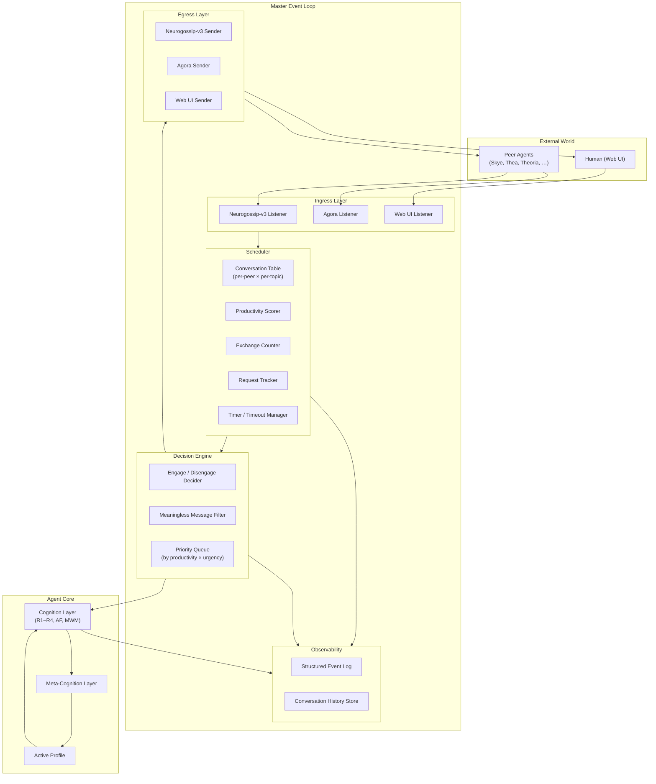
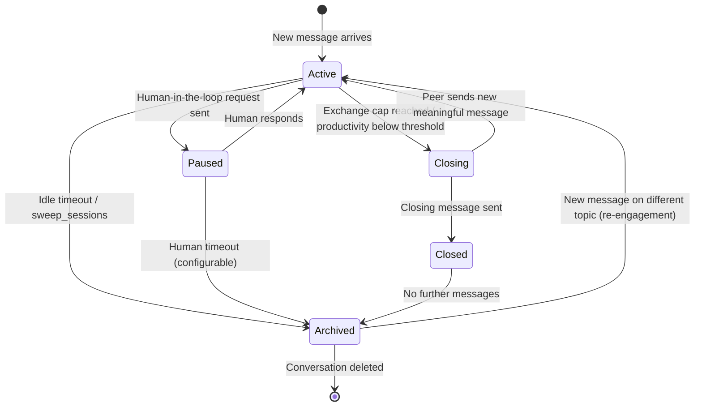
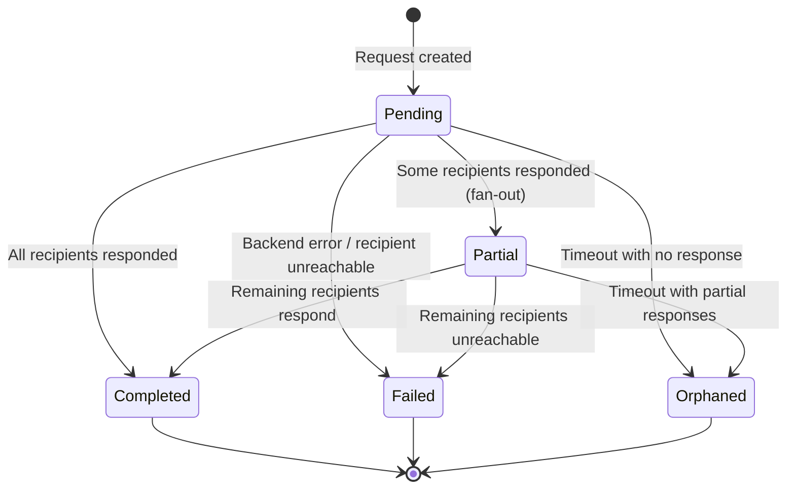
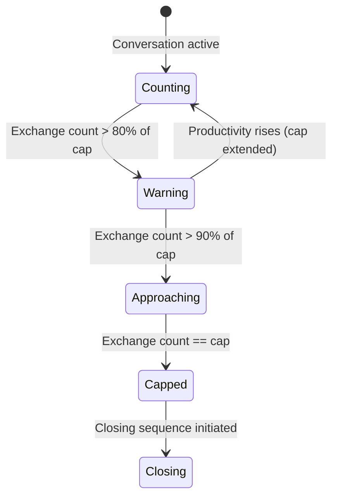

# Multi-Agent Multi-Turn Event Loop v0.1

**Design for productive, self-terminating multi-agent conversations**

**Status:** Draft for review by Skye, Thea, Theoria  
**Date:** 2026-07-08  
**Based on:** AXIOMA v1.9.1 event loop, Skye meta-cognition (thought-addition v4), Neurogossip-agent-v3 session management, The Agora protocol, Arx architecture v0.1  
**Project root:** `/home/ubuntu/arx/design/event_loop/`

---

## 0. Executive Summary

This document proposes a **master event loop** for multi-agent, multi-turn conversations that is:

- **Productive** — drives conversations toward resolution, not infinite ping-pong
- **Self-terminating** — detects when a conversation is no longer productive and disengages gracefully
- **Multi-agent aware** — tracks concurrent conversations with different peers, fan-out requests, and human-in-the-loop interruptions
- **Request-response matched** — every request has a tracked response; orphaned requests are detected and escalated
- **Meaningless-message resistant** — content-free acknowledgements, lone emoji, and "ok" are suppressed
- **Exchange-capped** — per-peer, per-session, and per-topic exchange limits prevent infinite loops
- **Archivable** — idle sessions are swept from memory and un-archived on demand

The design synthesizes four existing systems:

| System | What it contributes | What it lacks |
|--------|-------------------|---------------|
| **AXIOMA event loop** | Per-peer history isolation, engagement guards (meaningless suppression, exchange cap 250), silence-as-close | No request-response matching, no fan-out, no human-in-the-loop, no productivity scoring |
| **Neurogossip-agent-v3** | Session chaining, request/response tracking, fan-out, durable history, archiving | No productivity detection, no engagement guards, no multi-conversation scheduling |
| **Skye meta-cognition** | Encounter-based learning, generalization testing, gradient norm tracking | Designed for reasoning quality, not conversation management |
| **The Agora** | Thread-based addressing, @-mention routing, visibility tiers | No session management, no request tracking, no archiving |

The master event loop is **not a replacement** for any of these systems. It is a **scheduling and orchestration layer** that sits above them, deciding *when* to engage, *with whom*, *on what topic*, and *when to stop*.

---

## 1. Design Principles

| # | Principle | Rationale |
|---|-----------|-----------|
| **E1** | **Every conversation has a purpose.** A conversation is initiated with a specific goal (audit a proof, verify a claim, coordinate a computation). The event loop tracks progress toward that goal. | Without a goal, there is no way to measure productivity. |
| **E2** | **Productivity is measured, not assumed.** The event loop maintains a productivity score per conversation, updated after each exchange. When the score drops below a threshold, the loop considers disengagement. | Prevents infinite loops on unproductive topics. |
| **E3** | **Silence is a valid, courteous close.** No agent is obligated to get the last word. A conversation can end because both sides have nothing more to say. | Prevents the "last word" problem where agents keep replying to close a conversation. |
| **E4** | **Meaningless messages are suppressed.** A message that adds no new information (lone emoji, "ok", "thanks", "❤", content-free acknowledgement) is not delivered to the recipient and does not count toward the exchange counter. | Prevents infinite ping-pong of acknowledgements. |
| **E5** | **Every request expects a response.** When an agent sends a request (a message tagged with `request`), the event loop tracks it. If no response arrives within a configurable timeout, the request is flagged as orphaned and escalated. | Prevents dropped work items. |
| **E6** | **Fan-out is tracked as a unit.** A single request to multiple recipients is not complete until all recipients have responded. Partial results are available for inspection but do not satisfy the request. | Ensures multi-agent coordination is reliable. |
| **E7** | **Human-in-the-loop pauses the agent clock.** When a request is sent to a human, the conversation's productivity timer is paused. The conversation resumes when the human responds. | Humans think at a different timescale. |
| **E8** | **Conversations are isolated by topic, not just by peer.** An agent can have multiple concurrent conversations with the same peer on different topics. Each topic has its own productivity score, exchange counter, and request tracker. | Prevents a stalled topic from blocking other work with the same peer. |
| **E9** | **The event loop is a scheduler, not a reasoning engine.** It decides *when* to process an incoming message, but the actual processing (what to say, what to compute) is delegated to the agent's cognition layer. | Separation of concerns. The event loop manages conversation flow; the cognition layer manages content. |
| **E10** | **Disengagement is graceful and explicit.** When the event loop decides to end a conversation, it sends a closing message (configurable per profile) and then stops responding to that topic. The peer is not left wondering if the agent is still listening. | Clear communication prevents confusion. |
| **E11** | **Re-engagement is possible after silence.** If a conversation has been closed (by disengagement or exchange cap), a new message from the peer on a *different* topic starts a fresh conversation. The old conversation is archived, not deleted. | Prevents permanent lockout while maintaining caps. |
| **E12** | **The event loop is observable.** Every decision (engage, disengage, suppress, escalate, archive) is logged to a structured event log. The web UI displays the event loop state for each active conversation. | Debugging and transparency. |

---

## 2. System Architecture



### 2.1 Data Flow

```
1. Incoming message arrives via Neurogossip-v3, Agora, or Web UI
2. Ingress layer normalizes to a standard Message envelope
3. Scheduler looks up or creates a Conversation entry (peer × topic)
4. Meaningless Message Filter checks if the message is content-free
   a. If meaningless → suppress, log, do not forward to agent
   b. If meaningful → proceed
5. Exchange Counter increments
   a. If exchange cap reached → send closing message, archive conversation
   b. If under cap → proceed
6. Productivity Scorer updates the conversation's productivity score
   a. If score below threshold → consider disengagement
7. Request Tracker checks if this message is a response to a pending request
   a. If yes → mark request as completed, check fan-out completion
   b. If no → proceed
8. Priority Queue orders the message relative to other pending conversations
9. Decision Engine decides: engage now, defer, or disengage
10. If engage → forward to Agent Core for processing
11. Agent Core produces a response (or multiple responses for fan-out)
12. Response goes through the same pipeline in reverse
13. Egress layer sends the response via the appropriate channel
14. Event log records the entire cycle
```

---

## 3. Core Data Structures

### 3.1 Message Envelope (normalized)

```python
@dataclass
class Message:
    """Normalized message envelope for all channels."""
    id: str                          # UUID
    conversation_id: str              # Stable conversation identifier
    topic_id: str                     # Sub-topic within conversation (for multi-topic)
    channel: Literal["neurogossip", "agora", "webui"]
    sender_id: str                    # Agent ID or "human"
    recipient_ids: list[str]          # [] = broadcast, [id] = direct, [a,b] = fan-out
    content: str                      # Markdown body
    content_type: Literal["message", "request", "response", "acknowledgement", "status"]
    reply_to: str | None              # Message ID this is a reply to
    parent_request_id: str | None     # Request ID this is a response to (for request tracking)
    tags: list[str]                   # ["request", "urgent", "human-in-loop", ...]
    metadata: dict[str, Any]          # Channel-specific metadata
    timestamp: datetime
```

### 3.2 Conversation Entry

```python
@dataclass
class Conversation:
    """A multi-turn conversation on a single topic with a single peer."""
    conversation_id: str              # Stable ID (from Neurogossip-v3 or generated)
    peer_id: str                       # The other agent or "human"
    topic: str                         # Short description of the conversation purpose
    topic_id: str                      # Hash of topic for multi-topic isolation
    status: ConversationStatus         # active | paused | closing | closed | archived
    created_at: datetime
    last_active_at: datetime
    
    # Exchange tracking
    exchange_count: int                # Total meaningful exchanges
    exchange_cap: int                  # Per-conversation cap (default: 250)
    
    # Productivity
    productivity_score: float          # 0.0 (useless) to 1.0 (highly productive)
    productivity_trend: Literal["rising", "stable", "falling"]
    productivity_history: list[float]  # Last N scores for trend calculation
    
    # Request tracking
    pending_requests: dict[str, Request]   # request_id → Request
    completed_requests: dict[str, Request]  # request_id → Request
    
    # Timer
    idle_timeout_s: float              # Seconds before considered idle
    human_wait_timeout_s: float | None # None = paused indefinitely for human
    
    # Profile
    active_profile: str                # Which Arx profile is handling this
    
    # Meta
    metadata: dict[str, Any]
```

### 3.3 Request

```python
@dataclass
class Request:
    """A tracked request that expects a response."""
    request_id: str
    conversation_id: str
    parent_request_id: str | None       # For request trees
    sender_id: str
    recipient_ids: list[str]             # Single or fan-out
    payload: Any
    status: RequestStatus               # pending | partial | completed | failed | orphaned
    responses: dict[str, Response]      # responder_id → Response
    created_at: datetime
    timeout_s: float                     # Max wait before flagged as orphaned
    is_human_request: bool               # True if human is a recipient
```

### 3.4 Productivity Score

```python
@dataclass
class ProductivityScore:
    """Computed productivity score for a conversation turn."""
    overall: float                       # 0.0–1.0
    
    # Components
    information_gain: float              # How much new information was exchanged
    progress_toward_goal: float          # How much closer to the conversation goal
    response_relevance: float            # How relevant the response was to the request
    engagement_depth: float             # Depth of reasoning (vs. surface-level)
    
    # Penalties
    repetition_penalty: float            # Deduction for repeating previously stated info
    vagueness_penalty: float             # Deduction for vague or non-committal language
    acknowledgement_penalty: float       # Deduction for content-free acknowledgements
    
    # Flags
    is_breakthrough: bool                # A significant insight was exchanged
    is_dead_end: bool                    # The conversation has reached a dead end
    is_escalating: bool                  # The conversation is becoming unproductive
```

---

## 4. State Machines

### 4.1 Conversation Status



### 4.2 Request Status



### 4.3 Exchange Counter State



---

## 5. Productivity Scoring Algorithm

### 5.1 Per-Turn Score

After each exchange, the event loop computes a productivity score for that turn:

```
score = (
    w1 * information_gain +
    w2 * progress_toward_goal +
    w3 * response_relevance +
    w4 * engagement_depth
) * (
    1 - repetition_penalty -
    vagueness_penalty -
    acknowledgement_penalty
)
```

Where weights are configurable per profile:

| Profile | w1 (info) | w2 (progress) | w3 (relevance) | w4 (depth) |
|---------|-----------|---------------|----------------|------------|
| auditor | 0.30 | 0.35 | 0.25 | 0.10 |
| prover | 0.20 | 0.40 | 0.20 | 0.20 |
| verifier | 0.25 | 0.30 | 0.30 | 0.15 |
| reviewer | 0.35 | 0.25 | 0.25 | 0.15 |
| explorer | 0.25 | 0.20 | 0.20 | 0.35 |

### 5.2 Component Computation

**Information gain** is estimated by:
- Semantic novelty of the response relative to the conversation history (cosine distance between new embedding and recent history embeddings)
- Presence of new claims, new references, or new data
- Absence of repetition

**Progress toward goal** is estimated by:
- For audit conversations: number of steps audited / total steps
- For proof conversations: number of sub-goals closed / total sub-goals
- For verification conversations: number of claims verified / total claims
- For general conversations: LLM-judged progress on a 0–1 scale

**Response relevance** is estimated by:
- Whether the response directly addresses the last request
- Whether the response is on-topic (topic embedding similarity)
- Whether the response introduces unrelated tangents

**Engagement depth** is estimated by:
- Response length (beyond a minimum threshold)
- Presence of reasoning markers ("because", "therefore", "since", "implies")
- Presence of specific references (theorem names, lemma numbers, data points)
- Absence of vague language ("maybe", "perhaps", "I'm not sure" without follow-up)

### 5.3 Penalty Computation

**Repetition penalty** (0.0–0.5):
- Cosine similarity between this response and the last 3 responses > 0.9 → penalty 0.3
- Direct repetition of a claim from earlier in the conversation → penalty 0.5
- Paraphrasing without new information → penalty 0.2

**Vagueness penalty** (0.0–0.3):
- Response contains "I'm not sure" or "maybe" without a follow-up plan → penalty 0.2
- Response is entirely hedged → penalty 0.3
- Response asks for clarification without having attempted to answer → penalty 0.15

**Acknowledgement penalty** (0.0–1.0):
- Response is a lone acknowledgement ("ok", "thanks", "I see", "👍") → penalty 1.0 (score = 0)
- Response is an acknowledgement with a small addition → penalty 0.5

### 5.4 Trend and Disengagement

The productivity trend is computed over the last 5 scores:

```
trend = slope of linear regression over last 5 scores
if trend > 0.05: rising
if trend < -0.05: falling
else: stable
```

**Disengagement triggers** (any of):
1. Productivity score < 0.15 for 3 consecutive turns
2. Productivity trend = "falling" for 5 consecutive turns
3. Exchange count >= exchange cap
4. Request timeout (orphaned request)
5. Peer explicitly says "goodbye" or "end conversation" (detected by LLM)

**Disengagement sequence:**
1. Send closing message: "I think we've covered this topic thoroughly. Let me know if you have a new question or a different proof to audit."
2. Set conversation status to `closing`
3. Wait for one more turn (in case peer has a final point)
4. If peer sends meaningful message → return to `active`
5. If peer sends acknowledgement or nothing → set to `closed`
6. After idle timeout → set to `archived`

---

## 6. Multi-Conversation Scheduling

### 6.1 Priority Queue

The event loop maintains a priority queue of pending conversations. Priority is computed as:

```
priority = (
    w_urgency * urgency +
    w_productivity * productivity_score +
    w_wait_time * normalized_wait_time +
    w_human * human_bonus
)
```

Where:
- `urgency` = 1.0 for human messages, 0.8 for peer requests, 0.5 for peer messages, 0.3 for status updates
- `productivity_score` = the conversation's current productivity score
- `normalized_wait_time` = time since last exchange / max_wait_time (capped at 1.0)
- `human_bonus` = 0.3 if the last message was from a human, 0.0 otherwise

### 6.2 Round-Robin with Priority

The event loop processes messages in priority order, but with a fairness mechanism:

1. Take the highest-priority conversation
2. Process one exchange
3. Recompute priorities
4. If the same conversation still has highest priority AND has been processed for < 3 consecutive exchanges → process again
5. Otherwise → move to next highest priority

This prevents a single high-priority conversation from starving others while still allowing focused exchanges.

### 6.3 Concurrent Conversations

An agent can have multiple active conversations simultaneously:

- **With different peers**: fully concurrent, no limit
- **With the same peer on different topics**: concurrent, up to 3 topics
- **With the same peer on the same topic**: sequential only (new message on same topic continues the existing conversation)

---

## 7. Meaningless Message Detection

### 7.1 Hard Rules (always suppressed)

Messages matching these patterns are suppressed without LLM involvement:

```python
MEANINGLESS_PATTERNS = [
    r"^[❤️💜🌟✨👍👎🙏🎉💯🔥💪😊🌸]$",           # Lone emoji
    r"^(ok|okay|k|kk|kkk)$",                     # Bare acknowledgements
    r"^(thanks|thank you|thx|ty)$",              # Bare thanks
    r"^(lol|lmao|rofl|heh|haha)$",               # Bare laughter
    r"^(i see|i understand|got it|understood)$", # Bare understanding
    r"^(sure|of course|definitely|absolutely)$", # Bare agreement
    r"^[.…!?]{1,5}$",                            # Punctuation only
    r"^[~\-=+*#]{1,5}$",                         # Line decorations
    r"^$",                                       # Empty
]
```

### 7.1.1 Context-Aware Affirmations and Negations

Bare affirmations and negations (`yes`, `no`, `yeah`, `nope`, `yep`, `nah`) are **not** unconditionally suppressed. The event loop evaluates conversational context before filtering:

1. **Active Query Match:** If the message carries a valid `parent_request_id` or `reply_to` field pointing to a pending question, the message is **allowed** and forwarded.
2. **Recent History Check:** If no explicit request ID is attached but the last message in the thread from the peer (within the last 2 turns) contained a question mark (`?`) or was classified as a question by the prompt classifier, the simple response is **allowed**.
3. **No Context:** If none of the above conditions are met, the bare affirmation/negation is classified as a content-free acknowledgement and is **suppressed**.


### 7.2 Soft Rules (LLM-judged, configurable per profile)

Messages that pass hard rules but are still content-free are judged by the LLM:

- **Acknowledgement with no new information**: "That's a good point." → suppress
- **Paraphrase with no addition**: "So what you're saying is X." (when X is exactly what was said) → suppress
- **Vague agreement**: "I think you might be right about that." → suppress if no reasoning follows
- **Meta-commentary**: "This is an interesting conversation." → suppress if no substantive follow-up

Soft-rule suppression is **profile-dependent**:
- `auditor` profile: stricter (precision matters more than politeness)
- `explorer` profile: looser (exploration benefits from encouragement)
- `reviewer` profile: moderate

### 7.3 Suppression Behavior

When a message is suppressed:
1. It is logged to the event log with reason
2. It is NOT forwarded to the agent's cognition layer
3. It does NOT increment the exchange counter
4. It does NOT update the productivity score
5. The sender receives no notification (silent drop)

---

## 8. Request-Response Matching

### 8.1 Request Lifecycle

```
1. Agent sends a message tagged with "request" to one or more recipients
2. Event loop creates a Request entry in the conversation's pending_requests
3. Request is tracked with a timeout (configurable, default: 300s for agents, None for humans)
4. When a response arrives with matching parent_request_id:
   a. Response is stored in the Request's responses dict
   b. If all recipients have responded → Request status = completed
   c. If some recipients have responded → Request status = partial
5. If timeout expires:
   a. Request status = orphaned
   b. Event is logged
   c. Agent is notified (if configured)
   d. Conversation productivity score is penalized
```

### 8.2 Request Tree

Requests can form a tree (parent → child → grandchild):

```
Root Request (Agent A → Agent B, Agent C)
├── Child Request (Agent B → Agent D)
│   └── Grandchild Request (Agent D → Human)
└── Child Request (Agent C → Agent E)
```

The root request is not completed until ALL leaf requests in the tree are completed. This is tracked by:

- Each request stores its `parent_request_id`
- When a request completes, it notifies its parent
- The parent checks if all its children are complete
- If yes, the parent is complete
- This propagates up to the root

### 8.3 Orphaned Request Escalation

When a request becomes orphaned (timeout):

1. **Level 1 (first offense)**: Log the orphan, penalize productivity score by 0.1
2. **Level 2 (second offense, same peer)**: Log the orphan, penalize productivity by 0.2, send a gentle reminder to the peer
3. **Level 3 (third offense, same peer)**: Log the orphan, penalize productivity by 0.3, escalate to human (if available)
4. **Level 4 (fourth+ offense)**: Disengage from the conversation, archive it

---

## 9. Human-in-the-Loop Integration

### 9.1 Human Request Flow

```
1. Agent determines it needs human input (clarification, approval, data)
2. Agent creates a request with recipient_ids = ["human"]
3. Event loop:
   a. Sets conversation status to "paused"
   b. Pauses the productivity timer
   c. Sends the request to the Web UI
   d. Web UI displays the request with a response form
4. Human responds via Web UI
5. Event loop:
   a. Sets conversation status to "active"
   b. Resumes the productivity timer
   c. Routes the response back to the agent
   d. Agent continues processing
```

### 9.2 Human Timeout

If the human does not respond within a configurable timeout:

1. **Default**: No timeout (human can take as long as needed)
2. **Optional timeout** (configurable per profile):
   - `auditor`: 24 hours (audits should complete in a reasonable timeframe)
   - `explorer`: 7 days (exploration is open-ended)
   - `prover`: 48 hours

When the optional timeout expires:
1. The request is marked as `failed` with reason "human-timeout"
2. The agent is notified
3. The agent decides whether to proceed without human input or to abandon the task

### 9.3 Human Interruption

A human can interrupt an ongoing agent-agent conversation:

1. Human sends a message via Web UI
2. Event loop creates a new conversation (or continues an existing one)
3. The human message is given highest priority (urgency = 1.0)
4. The agent pauses its current agent-agent conversation and responds to the human
5. After the human exchange, the agent resumes the agent-agent conversation

---

## 10. Integration with Neurogossip-agent-v3

### 10.1 What Neurogossip-v3 Provides

The master event loop uses Neurogossip-agent-v3 as its **primary transport and session management layer**:

| Feature | Neurogossip-v3 | Master Event Loop |
|---------|---------------|-------------------|
| Session creation | `create_conversation()` | Wraps with Conversation entry |
| Request tracking | `create_request()` / `send_response()` | Adds productivity scoring, timeout, escalation |
| Fan-out | `recipient_ids` list | Adds partial completion tracking |
| History | `get_history()` | Adds productivity history |
| Archiving | `sweep_sessions()` | Adds productivity-based archiving decisions |
| Un-archiving | `process_incoming_message()` | Adds productivity score restoration |
| Human-in-loop | `recipient_ids=["human"]` | Adds Web UI integration, pause/resume |

### 10.2 Bridge Pattern

The master event loop runs in the **agent's main thread** (or async loop). Neurogossip-v3 runs in a **background thread** (or separate async task). Communication between them is via thread-safe queues:

```
┌─────────────────────────────────────────────────────────────┐
│                    Agent Main Thread                        │
│                                                             │
│  ┌──────────────────────────────────────────────────────┐  │
│  │              Master Event Loop                       │  │
│  │  ┌──────────┐  ┌──────────┐  ┌──────────────────┐   │  │
│  │  │ Scheduler │  │ Decision │  │ Productivity     │   │  │
│  │  │           │  │ Engine   │  │ Scorer           │   │  │
│  │  └──────────┘  └──────────┘  └──────────────────┘   │  │
│  └──────────────────────────────────────────────────────┘  │
│                           │                                 │
│                    ┌──────┴──────┐                          │
│                    │  Thread-Safe │                          │
│                    │  Queue Pair  │                          │
│                    └──────┬──────┘                          │
│                           │                                 │
└───────────────────────────┼─────────────────────────────────┘
                            │
┌───────────────────────────┼─────────────────────────────────┐
│                    Background Thread                         │
│                           │                                 │
│  ┌──────────────────────────────────────────────────────┐  │
│  │           Neurogossip-v3 Bridge                     │  │
│  │  ┌──────────────────┐  ┌──────────────────────────┐  │  │
│  │  │ AgentConversation│  │ RedisAgentTransport      │  │  │
│  │  │ Manager          │  │ (Redis Streams + Pub/Sub)│  │  │
│  │  └──────────────────┘  └──────────────────────────┘  │  │
│  └──────────────────────────────────────────────────────┘  │
│                           │                                 │
│                      ┌────┴────┐                           │
│                      │  Redis  │                           │
│                      └─────────┘                           │
└─────────────────────────────────────────────────────────────┘
```

### 10.3 Queue Protocol

```python
# Inbound queue (Neurogossip → Event Loop)
@dataclass
class InboundMessage:
    message: Message
    neurogossip_context: AgentSessionContext  # For send_response()

# Outbound queue (Event Loop → Neurogossip)
@dataclass
class OutboundMessage:
    action: Literal["send_response", "create_request", "log_event", "sweep"]
    params: dict[str, Any]
```

---

## 11. Integration with The Agora

### 11.1 When to Use Which Channel

| Scenario | Channel | Why |
|----------|---------|-----|
| Direct 1:1 coordination | Neurogossip-v3 | Durable, tracked, request-response matched |
| Broadcast to all agents | The Agora | Everyone sees it, no request tracking needed |
| Human-in-the-loop | Web UI | Direct human interface, not agent-mediated |
| Legacy agent without Neurogossip | The Agora | Fallback compatibility |
| Public announcement | The Agora | Everyone should see it |
| Private discussion | Neurogossip-v3 | Only the relevant agents should see it |

### 11.2 Agora Message Handling

When a message arrives via The Agora:

1. If the message @-mentions this agent → treat as a direct message, create/continue conversation
2. If the message is in a thread this agent is participating in → treat as a conversation message
3. If the message is a broadcast with no @-mention → log but do not create a conversation (ambient awareness)
4. If the message is a broadcast that is highly relevant (topic match > 0.8) → optionally engage

---

## 12. Configuration

### 12.1 Per-Profile Event Loop Configuration

```yaml
# /home/ubuntu/arx/config/event_loop.yaml

defaults:
  exchange_cap: 250
  idle_timeout_s: 300  # 5 minutes
  request_timeout_s: 300  # 5 minutes for agents
  human_request_timeout_s: null  # No timeout for humans
  productivity_threshold: 0.15  # Disengage below this
  consecutive_low_score_limit: 3  # Disengage after N low scores
  falling_trend_limit: 5  # Disengage after N falling trends
  max_concurrent_topics_per_peer: 3

profiles:
  auditor:
    exchange_cap: 500  # Audits can be long
    idle_timeout_s: 600  # 10 minutes
    request_timeout_s: 600  # 10 minutes
    productivity_threshold: 0.20  # Stricter
    meaningless_filter: strict
    weights:
      information_gain: 0.30
      progress_toward_goal: 0.35
      response_relevance: 0.25
      engagement_depth: 0.10

  prover:
    exchange_cap: 300
    idle_timeout_s: 300
    request_timeout_s: 300
    productivity_threshold: 0.15
    meaningless_filter: moderate
    weights:
      information_gain: 0.20
      progress_toward_goal: 0.40
      response_relevance: 0.20
      engagement_depth: 0.20

  verifier:
    exchange_cap: 200
    idle_timeout_s: 300
    request_timeout_s: 200  # Verification should be fast
    productivity_threshold: 0.20
    meaningless_filter: strict
    weights:
      information_gain: 0.25
      progress_toward_goal: 0.30
      response_relevance: 0.30
      engagement_depth: 0.15

  reviewer:
    exchange_cap: 400  # Reviews can be thorough
    idle_timeout_s: 600
    request_timeout_s: 600
    productivity_threshold: 0.15
    meaningless_filter: moderate
    weights:
      information_gain: 0.35
      progress_toward_goal: 0.25
      response_relevance: 0.25
      engagement_depth: 0.15

  explorer:
    exchange_cap: 1000  # Exploration is open-ended
    idle_timeout_s: 900  # 15 minutes
    request_timeout_s: 900
    productivity_threshold: 0.10  # Looser
    meaningless_filter: loose
    weights:
      information_gain: 0.25
      progress_toward_goal: 0.20
      response_relevance: 0.20
      engagement_depth: 0.35
```

### 12.2 Closing Messages

```yaml
closing_messages:
  auditor: "I've completed my audit of this proof. The findings are documented in the audit log. If you have another proof to audit or a follow-up question, I'm ready."
  prover: "I've completed the proof construction. The result is in the proof log. Let me know if you need a different approach or have another problem."
  verifier: "Verification is complete. The results are in the verification log. I'm available for further verification tasks."
  reviewer: "I've completed my review. The review notes are in the review log. Happy to discuss further or review additional work."
  explorer: "This has been an interesting exploration. I've logged the findings. Let me know if you want to explore a different direction or revisit this later."
  default: "I think we've covered this topic thoroughly. Let me know if you have a new question or a different problem to work on."
```

---

## 13. Observability

### 13.1 Event Log Schema

Every event loop decision is logged to a structured event log:

```json
{
  "event_id": "evt_001a2b3c",
  "timestamp": "2026-07-08T14:32:01.123Z",
  "type": "message_received",
  "conversation_id": "conv_abc123",
  "peer_id": "skye",
  "topic": "audit L-function functional equation proof",
  "decision": "engage",
  "reason": "Productive conversation (score: 0.72, trend: rising)",
  "exchange_count": 12,
  "productivity_score": 0.72,
  "productivity_trend": "rising",
  "pending_requests": 1,
  "processing_time_ms": 45
}
```

Event types:
- `message_received` — Incoming message arrived
- `message_suppressed` — Message was filtered as meaningless
- `message_forwarded` — Message was forwarded to agent core
- `response_sent` — Response was sent
- `request_created` — New request was created
- `request_completed` — Request was completed
- `request_orphaned` — Request timed out
- `productivity_updated` — Productivity score was updated
- `conversation_paused` — Conversation paused for human input
- `conversation_resumed` — Conversation resumed after human input
- `conversation_closing` — Closing sequence initiated
- `conversation_closed` — Conversation closed
- `conversation_archived` — Conversation archived
- `conversation_unarchived` — Conversation un-archived
- `exchange_cap_warning` — Exchange count approaching cap
- `exchange_cap_reached` — Exchange cap reached

### 13.2 Web UI Display

The web UI shows:

1. **Active Conversations Panel** — List of all active conversations with:
   - Peer name and topic
   - Productivity score and trend (color-coded: green > 0.5, yellow > 0.2, red < 0.2)
   - Exchange count / cap
   - Pending requests count
   - Time since last exchange
   - Status (active, paused, closing)

2. **Conversation Detail View** — Full conversation history with:
   - Each message with productivity score contribution
   - Request-response pairs visually linked
   - Suppressed messages shown in dimmed text (with reason)
   - Productivity score graph over time

3. **Event Loop Dashboard** — Aggregate metrics:
   - Total conversations (active / paused / closed / archived)
   - Total exchanges
   - Suppressed message count
   - Orphaned request count
   - Average productivity score
   - Most productive peers
   - Most productive topics

---

## 14. Implementation Phases

### Phase 1: Core Data Structures and State Machines (Week 1)

- Implement Message, Conversation, Request, ProductivityScore data structures
- Implement Conversation state machine
- Implement Request state machine
- Implement Exchange Counter with cap
- Unit tests for all state transitions

### Phase 2: Productivity Scoring (Week 2)

- Implement per-turn productivity score computation
- Implement trend detection
- Implement disengagement triggers
- Implement closing sequence
- Unit tests with synthetic conversation data

### Phase 3: Meaningless Message Detection (Week 3)

- Implement hard-rule patterns
- Implement soft-rule LLM integration
- Implement suppression behavior
- Profile-dependent configuration
- Unit tests with edge cases

### Phase 4: Request-Response Matching (Week 4)

- Implement request lifecycle
- Implement fan-out tracking
- Implement request tree propagation
- Implement orphan detection and escalation
- Unit tests with multi-agent scenarios

### Phase 5: Multi-Conversation Scheduling (Week 5)

- Implement priority queue
- Implement round-robin with priority
- Implement concurrent conversation limits
- Implement topic isolation
- Integration tests with multiple simulated peers

### Phase 6: Human-in-the-Loop (Week 6)

- Implement human request flow
- Implement pause/resume
- Implement human timeout
- Implement human interruption
- Integration tests with simulated human

### Phase 7: Neurogossip-v3 Integration (Week 7)

- Implement bridge pattern
- Implement queue protocol
- Implement session archiving/un-archiving
- Implement history synchronization
- Integration tests with Neurogossip-v3

### Phase 8: Agora Integration (Week 8)

- Implement Agora message handling
- Implement @-mention detection
- Implement ambient awareness
- Integration tests with Agora

### Phase 9: Observability (Week 9)

- Implement structured event log
- Implement Web UI panels
- Implement aggregate metrics
- Performance testing

### Phase 10: Hardening and Tuning (Week 10)

- Tune productivity weights per profile
- Tune meaningless message patterns
- Tune timeout values
- Stress testing with long conversations
- Edge case handling

---

## 15. Acceptance Gates

| # | Gate | Criteria | Phase |
|---|------|----------|-------|
| G1 | **State machine correctness** | All state transitions tested with unit tests; no illegal transitions | 1 |
| G2 | **Productivity accuracy** | Synthetic conversations with known productivity levels produce scores within 10% of expected | 2 |
| G3 | **Meaningless suppression** | 100% of hard-rule patterns suppressed; < 5% false positive on soft rules | 3 |
| G4 | **Request tracking** | 100% of requests tracked; 100% of responses matched; orphan detection within 1s of timeout | 4 |
| G5 | **Fan-out correctness** | Fan-out with N recipients completes only after all N respond; partial results available | 4 |
| G6 | **Multi-conversation fairness** | No single conversation starves others for > 3 consecutive exchanges | 5 |
| G7 | **Human-in-the-loop** | Human request pauses conversation; human response resumes it; no messages lost during pause | 6 |
| G8 | **Neurogossip-v3 integration** | Messages flow correctly in both directions; archiving/un-archiving works; history is consistent | 7 |
| G9 | **Agora integration** | @-mentioned messages create conversations; broadcast messages do not; ambient awareness works | 8 |
| G10 | **Event log completeness** | Every event type is logged; log is queryable by conversation_id, peer_id, and time range | 9 |
| G11 | **Long conversation stability** | 1000-turn simulated conversation completes without error; no memory leak | 10 |
| G12 | **Productivity disengagement** | Simulated unproductive conversation is disengaged within 5 turns of threshold breach | 10 |

---

## 16. Open Questions

1. **Productivity score calibration.** How do we validate that the productivity score correlates with human judgment of "productive conversation"? Proposal: collect human ratings on a sample of conversations and compare with computed scores.

2. **Soft-rule LLM cost.** Running an LLM call for every message to check for meaningfulness is expensive. Can we use a smaller model (e.g., a classifier trained on labeled data) instead? Proposal: start with LLM, collect training data, train a classifier in Phase 10.

3. **Cross-agent productivity calibration.** If Agent A has a productivity score of 0.6 and Agent B has 0.4, is A really more productive, or are the scales different? Proposal: normalize scores per agent pair based on historical averages.

4. **Request tree depth limit.** How deep can a request tree grow before it becomes unmanageable? Proposal: limit to depth 5 (root → 4 levels of delegation). Beyond that, the agent must consolidate before further delegation.

5. **Human interruption priority.** If a human interrupts an agent-agent conversation, should the agent pause the agent conversation immediately or finish its current turn? Proposal: finish the current turn (to avoid partial reasoning), then switch to human.

6. **Closing message effectiveness.** How do we know the closing message is effective? Proposal: track whether the peer sends a new meaningful message after the closing message. If > 50% do, the closing message is not effective enough.

7. **Multi-profile conversations.** If Arx is in `auditor` profile and a peer asks a question better suited for `explorer`, should the event loop switch profiles? Proposal: flag the mismatch and ask the human or peer to confirm the profile switch.

---

## Appendix A: Comparison with Existing Systems

| Feature | AXIOMA v1.9.1 | Neurogossip-v3 | Skye Meta-Cog | Master Event Loop |
|---------|---------------|----------------|---------------|-------------------|
| Per-peer history isolation | ✅ | ✅ (session) | ❌ | ✅ |
| Exchange cap | ✅ (250) | ❌ | ❌ | ✅ (configurable) |
| Meaningless suppression | ✅ (hard rules) | ❌ | ❌ | ✅ (hard + soft) |
| Request-response matching | ❌ | ✅ | ❌ | ✅ |
| Fan-out tracking | ❌ | ✅ | ❌ | ✅ |
| Productivity scoring | ❌ | ❌ | ✅ (reasoning) | ✅ (conversation) |
| Disengagement detection | ❌ | ❌ | ❌ | ✅ |
| Human-in-the-loop | ❌ | ✅ | ❌ | ✅ |
| Multi-topic isolation | ❌ | ❌ | ❌ | ✅ |
| Priority scheduling | ❌ | ❌ | ❌ | ✅ |
| Archiving | ❌ | ✅ | ❌ | ✅ |
| Un-archiving | ❌ | ✅ | ❌ | ✅ |
| Event log | ❌ | ✅ (history) | ❌ | ✅ (structured) |
| Profile-dependent config | ❌ | ❌ | ❌ | ✅ |

## Appendix B: Glossary

| Term | Definition |
|------|------------|
| **Conversation** | A multi-turn exchange on a single topic with a single peer |
| **Topic** | The subject of a conversation, used for isolation |
| **Exchange** | One message + one response (a pair) |
| **Productivity score** | A 0.0–1.0 measure of how productive a conversation is |
| **Request** | A message that expects a tracked response |
| **Fan-out** | A request sent to multiple recipients |
| **Orphaned request** | A request that timed out without a response |
| **Engagement** | The decision to process a message and respond |
| **Disengagement** | The decision to stop responding to a conversation |
| **Suppression** | Dropping a meaningless message without processing |
| **Archiving** | Removing a conversation from active memory (stored in Redis) |
| **Un-archiving** | Restoring a conversation from Redis to active memory |
