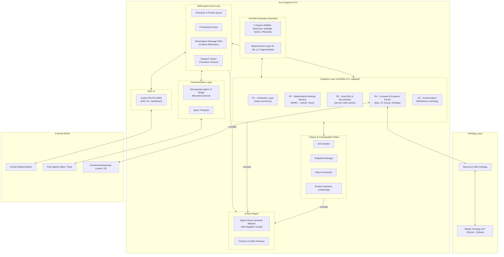

# Arx — Math Proof Audit Agent: Master Architecture Design v0.3.0

**Status:** Final (integrating AXIOMA Substrate, adapted Cognition Layer, Cryptographic Reproducibility, Multi-Agent Event Loop, θ-Rule Engine, and Master Ontology)  
**Date:** 2026-07-09  
**Based on:** AXIOMA v1.9.1/v2.0, Skye meta-cognition v4, J-Space, [ARX_ARCHITECTURE_v0.2.0.md](file:///home/ubuntu/arx/design/ARX_ARCHITECTURE_v0.2.0.md), [AUDIT_REPRODUCIBILITY_v0.3.0.md](file:///home/ubuntu/arx/design/AUDIT_REPRODUCIBILITY_v0.3.0.md), [MASTER_ONTOLOGY_v0.2.0.md](file:///home/ubuntu/arx/design/MASTER_ONTOLOGY_v0.2.0.md), [MULTI_AGENT_EVENT_LOOP_v0.2.0.md](file:///home/ubuntu/arx/design/MULTI_AGENT_EVENT_LOOP_v0.2.0.md), [NEUROCORE_SKILL_ONTOLOGY_v0.2.0.md](file:///home/ubuntu/arx/design/NEUROCORE_SKILL_ONTOLOGY_v0.2.0.md), and [THETA_RULE_INTEGRATION_v0.2.0.md](file:///home/ubuntu/arx/design/THETA_RULE_INTEGRATION_v0.2.0.md).  
**Project root:** `/home/ubuntu/arx/`

---

## 0. Executive Summary

Arx is an advanced AI agent specialized in **Math Proof Audit, Proof Provenance, and Reproducible Proofs**. It inherits the full AXIOMA substrate architecture and layers specialized cognitive, meta-cognitive, communication, rule enforcement, and ontological subsystems to create a unified, robust, and verifiable auditing environment.

This master document synthesizes the entire Arx agent architecture as of version 0.3.0. It defines:
1. **The AXIOMA Substrate & Adapted Cognition Layer:** Real-time proof auditing, verification effort budgeting, and status propagation rules.
2. **J-Space & Cryptographic Reproducibility System:** A content-addressed, hash-chained Directed Acyclic Graph (DAG) for audits that normalization-normalizes input text, caches non-deterministic LLM tokens, captures request-response external API logs, records cognitive vitals, and signs outputs inside a secure hardware enclave (TPM/HSM).
3. **Multi-Agent Multi-Turn Event Loop:** A goal-oriented, queue-bounded scheduling layer that tracks conversation threads, executes round-robin priority dispatching, filters meaningless messages while allowing context-aware affirmations, and terminates unproductive dialogs.
4. **θ-Rule Engine:** A natural language rule enforcement layer built on θ-Net (with a v0.1 vector-symbolic fallback and Anti-Negation Guard) that acts as a synchronous consultation gate across all agent actions.
5. **Master Ontology & Neurocore Skill:** A unified, reconciled graph (LMFDB, MathGLOSS, Our Ontology) partitioned into isolated sub-graphs (`VERIFY` vs. `RESEARCH`) that is exposed to the ecosystem via a stateless Neurocore skill.

---

## 1. Design Principles & Key Decisions

The engineering of Arx is guided by a unified set of principles spanning substrate coupling, proof safety, multi-agent coordination, and cryptographic verifiability.

### 1.1 Core Principles

| # | Principle | Source | Constraint / Behavioral Change |
|---|---|---|---|
| **P1** | **Audit is primary; generation is secondary.** | Arx | The system defaults to auditing existing proofs (finding gaps, checking dependencies) before generating new ones. |
| **P2** | **Provenance is structural, not asserted.** | Arx | Claims must carry an append-only, verifiable provenance chain detailing generating backends, inputs, and versions. |
| **P3** | **Reproducibility is the gate.** | Arx | A step is not marked `proven` unless it carries a recipe allowing bit-identical or structurally equivalent replay. |
| **P4** | **Epistemic isolation is enforced.** | Review | Speculative concepts (confidence < 0.8, e.g., consciousness) are isolated in a `RESEARCH` sub-graph, invisible to audits. |
| **P5** | **Rule enforcement is a consultation gate.** | θ-Rule | All agent components must synchronously consult the rule engine before executing any action (stamp, write, engage). |
| **P6** | **Every conversation has a goal.** | Event Loop | Conversations are tracked against specific tasks and disengaged when productivity trends below thresholds. |
| **P7** | **Silence is a courteous close.** | Event Loop | Agents do not require the "last word". A conversation can end gracefully because no new information remains. |
| **P8** | **Meaningless messages are suppressed.** | Event Loop | Content-free texts (emoji, lone thanks) are filtered, but context-aware binary answers (yes/no) are permitted. |

### 1.2 Key Design Decisions (v0.3.0)

- **D1: Timestamp Excluded from Node Hash:** To ensure that replay at a later date yields identical cryptographic hashes, timestamps are stored only as metadata and excluded from hash computations.
- **D2: LLM Outputs are Cached, Not Re-Run:** LLM inference is non-deterministic even at temperature 0.0. The exact raw tokens of all LLM calls are stored in the DAG node. Re-verification replays these cached tokens.
- **D3: API Request-Response Replay Logs:** External HTTP query details (headers, bodies) are logged. Verifiers run against local mock servers replaying these logs, protecting audits from external API payload shifts.
- **D4: Substrate Vitals Captured Per Node:** Cognitive vitals (θ, ΔΦ, ψ, fragmentation) are captured before every node generation. A change in cognitive state during a re-audit triggers a warning but does not fail structural verification.
- **D5: Hardware Key Enclaves:** Ed25519 private keys must be stored in secure TPM/HSM enclaves. A software keystore fallback is provided for v0.1, reading the passphrase from a file with `0600` permissions.
- **D6: Full Ontology Snapshots:** Snapshots of Our Ontology are written as complete content-addressed files rather than incremental diffs, avoiding cascade failures if a historical diff is corrupted.
- **D7: Input Normalization:** Input proofs are pre-processed (strip comments, canonicalize whitespace, Unicode NFC) to produce a `normalized_hash`, while retaining `original_hash` for provenance.
- **D8: Consensus Resolution Handoff:** Disagreements between agents are resolved via an escalation protocol that presents agent summaries and DAG diffs to a human reviewer, with a 24-hour timeout.

---

## 2. High-Level System Architecture

Arx acts as a composite agent orchestrating the AXIOMA substrate, an adapted cognition layer, a cryptographic reproducibility manager, a multi-agent event loop, and a rule engine.



### 2.1 The θ-Rule Consultation Flow
The θ-Rule engine operates as a synchronous consultation layer. Whenever a component proposes an action (e.g., sending a message, stamping a proof step, writing to a database), it sends the action and context to the engine. The engine executes a hybrid match, resolves conflicts, and returns a decision (`ALLOW`, `DENY`, `FLAG`, `ESCALATE`, `OVERRIDE_STATUS`, `PAUSE`, `LOG`), forcing the calling component to comply or abort.

### 2.2 The Bounded Neurogossip Bridge
The multi-agent event loop runs in the agent's main async thread. Interaction with the Redis-backed `Neurogossip-agent-v3` transport is mediated via bounded, thread-safe queues (maximum capacity: 1000 messages) to provide backpressure. If the queue is over 80% full, the event loop drops ambient Agora broadcasts without @-mentions to preserve resources for direct messages.

---

## 3. Substrate & Cognition Layer (AXIOMA Integration)

### 3.1 Substrate Vitals Coupling Rules
The AXIOMA substrate vitals (θ - disorientation, ΔΦ - fragmentation, ψ - integration) affect cognitive resource allocation and parallelism, but never mathematical validity:

- **θ < 2.0 (Low):** Normal operation; full audit pipeline runs.
- **2.0 ≤ θ < 4.0 (Moderate):** Reduce verification effort by one tier; skip heuristic backends.
- **θ ≥ 4.0 (High):** Pause new audit tasks; finish only the current step, queue subsequent steps.
- **ΔΦ > 0.7 (High):** Suspend all verification; checkpoint the audit DAG and enter recovery.
- **ψ < 0.3 (Low):** Reduce multi-backend parallelism; invoke Lean, Z3, and SymPy sequentially.

### 3.2 R1 — Verification Status Taxonomy
Proof steps are assigned specialized statuses during auditing:

- `audited`: The step's dependencies are verified, but no formal proof is available.
- `gap-detected`: A logical hole or missing link was found in the step's dependencies.
- `circular`: A cycle was detected in the step's transitive dependency closure.
- `provenance-broken`: Missing or corrupted logs/snapshots in the step's verification history.
- `corroborated`: Consistent with the Master Ontology, but lacks a formal proof.
- `ontology-unavailable`: The ontology API was unreachable during the audit check.
- `proven-with-contradiction`: Formally verified, but contradicts a `HIGH` priority structural ontology rule.
- `proven-with-note`: Formally verified, but contradicts a `NORMAL` priority property-level ontology rule.
- `formalization-uncertain`: Autoformalized code compiled, but failed the translation faithfulness check.
- `stale`: The ontology records referenced by this step have changed, requiring a re-audit.

Contradiction priority is category-based (structural/mapping conflicts = `HIGH`; property-level data conflicts = `NORMAL`), preventing speculative ontology nodes from being ignored due to low confidence scores.

### 3.3 R2 — Mathematical Working Memory (MWM)
The MWM caches mathematical terms and signatures. It contains pre-populated mathlib signatures (~282,207 theorems, ~133,813 definitions) and syncs daily via tag diffs. 
- **Limitations of Vector Search:** Embeddings (e.g., `text-embedding-3-small`) cannot reliably distinguish math signs or quantifier shifts. Thus, vector store matching is restricted to fuzzy concept discovery and terminology search. Exact matches use symbolic canonicalized keys and hash indices.

### 3.4 R3 — Goal DAG & Parser
Decomposes proofs into `ProofStep` nodes. It uses a **two-tier parser**:
1. **Hand-written Extractors:** Pattern matches common algebraic/number-theoretic structures (elliptic curve rank, conductor, L-function sign, Artin representation dimension).
2. **LLM Fallback:** Prompts an LLM with structured schemas for complex or non-standard claims.
- The **fallback rate** (fraction of LLM calls to total claims parsed) is tracked **per-audit** to monitor parsing quality.

### 3.5 R4 — Compute & Evidence Kernel
Integrates multiple verification backends (Lean4, Z3, Coq, Vampire, SymPy, SageMath, PARI/GP, GAP, mpmath). It adds an `ontology` backend that queries the Neurocore-Skill-Ontology.
- **Ontology Unavailability:** If the ontology API is unreachable, the verifier and auditor profiles stamp steps as `ontology-unavailable` and **prevent them from transitioning to `proven`**, flagging the gap in the report.

### 3.6 AF — Autoformalizer
Translates natural-language proof steps into formal statements. To prevent "garbage in, type-checked out" bugs, AF executes a **faithfulness check**: the LLM generates a natural-language description of its generated formal code; this description is semantic-similarity matched (threshold: 0.7) against the original proof step text.

---

## 4. J-Space & Cryptographic Reproducibility System

Arx represents every audit as a cryptographic, content-addressable, hash-chained Directed Acyclic Graph (DAG) packed into an archive.

### 4.1 Input Normalization
Before the initial `input_proof` node is hashed, the text passes through a deterministic normalization pipeline:
1. Strip comments (LaTeX `%`, Lean `--` / `/- -/`).
2. Canonicalize whitespace (replace tabs with spaces, compress multiple spaces, strip trailing lines).
3. Unicode NFC normalization.
4. Replace LaTeX symbols with canonical characters (e.g., `\mathbb{N}` -> `ℕ`).

The `input_proof` node stores both the `original_hash` (for user provenance) and the `normalized_hash` (the root commitment). If normalization fails due to syntax errors, the audit aborts and records the error in the DAG.

### 4.2 Cryptographic DAG Node Schema

```yaml
AuditNode:
  id: string                    # SHA256(content + parents + backend + nonce)
  type: enum {
    input_proof, decomposition, verification_step, cross_reference,
    rule_enforcement, status_assignment, aggregation, report_root, checkpoint,
    consensus_resolution
  }
  content: object               # Type-specific payload (capped at 1MB, or external hash)
  parents: List[string]         # Lexicographically sorted hashes of parent nodes
  backend:
    name: string                # "lean", "z3", "lmfdb", "ontology", "llm", "theta_rule"
    version: string             # Docker image hash or API version
    output_affecting_parameters: object  # Included in hash computation
    operational_parameters: object       # Excluded from hash (metadata only)
  timestamp: int | null         # Unix timestamp (metadata only - NOT in hash)
  nonce: string | null          # Seed for deterministic replay
  signature: string | null      # Signed by agent's enclave key
```

### 4.3 Deterministic Caching & API Replay
- **LLM Output Cache:** Re-verification uses cached raw LLM tokens stored inside the `decomposition` or `verification_step` nodes, bypassing live LLM calls which are non-deterministic.
- **API Replay Logs:** Every HTTP request to LMFDB or external APIs is stored as a request-response pair. During verification, the system runs against a mock API server that replays these cached bytes.
- **Checkpoint Nodes:** The DAG builder writes a `checkpoint` node every $N$ steps (default $N=10$). If the agent crashes, it recovers state by pulling the last checkpoint and resuming without re-running verified steps.

### 4.4 Enclave Key Management
- **Hardware Enclave:** All agent signatures must be computed inside a secure enclave (TPM, HSM, or SGX). The private key never leaves the enclave.
- **Passphrase Fallback:** In v0.1 environments lacking HSMs, the agent uses a software keystore encrypted at rest. The passphrase must be read from a file with `0600` permissions, with the path configured via environment variables.

### 4.5 Four Levels of Verification

1. **Level 1: Structural Verification (O(N) cost):** Verifies the DAG's well-formedness, sorted parent keys, and recalculates hashes (excluding timestamps and operational parameters). No backends are invoked.
2. **Level 2: Spot-Check Verification (Medium cost):** Selects a random sample of steps (default 10%) and re-runs the pinned backend Docker containers against the local mock API replay server and LLM cache.
3. **Level 3: Full Re-Audit (High cost):** Normalizes the input proof, loads the ontology snapshot and rule set, and re-executes the entire audit DAG using cached API/LLM logs. The final root hash must match.
4. **Level 4: Independent Re-Audit (Maximum cost):** A secondary agent (e.g., Thea) audits the same proof with live LLM and API queries, producing a separate DAG. The two DAGs are compared for **syntactic $\alpha$-equivalence** (formal statements identical up to variable renaming).

### 4.6 Consensus Protocol for Disagreements
When two independent audits disagree on status or identify contradictions:
1. **Automated resolution:** The system accepts the more thorough audit (if one used strictly more backends) or selects the lower confidence score (conservative principle).
2. **Human Escalation:** If automated checks fail, the system exports a one-page summary from each agent containing their verdicts, confidence ratings, and key points of divergence. These are bundled with a node diff and sent to the human reviewer.
3. **Review Actions:** The human can select one DAG as canonical, reject all, or trigger a re-audit with modified parameters.
4. **Timeout:** If the human fails to respond within 24 hours, the audit is stamped as `disputed` and preserved in an unresolved state.

---

## 5. Multi-Agent Multi-Turn Event Loop

Orchestrates agent engagement, scheduling, message routing, and disengagement.

```
Message Ingress
   │
   ▼
Hard-Rule Filter (Meaningless message check)
   │
   ▼
Context-Affirmation Check (Allow yes/no if answering pending question)
   │
   ▼
Exchange Counter (Increment; enforce cap)
   │
   ▼
Productivity Scorer (Compute turn score; monitor trend)
   │
   ▼
Priority Queue Scheduler (Sort by urgency × productivity)
   │
   ▼
Agent Cognition Layer (R1-R4 processing)
```

### 5.1 Meaningless Message Filter
To prevent infinite "thanks" / "ok" loops, messages matching `MEANINGLESS_PATTERNS` (lone emojis, bare agreements, bare thanks) are silently suppressed.
- **Context-Aware Affirmations:** Bare answers like `yes` and `no` are **allowed** if they carry a `parent_request_id` matching a pending question, or if the last message in the thread (within 2 turns) ended in a question mark.

### 5.2 Productivity Scorer
After each turn, the scheduler computes a productivity score:

$$\text{score} = (w_1 \cdot \text{info\_gain} + w_2 \cdot \text{progress} + w_3 \cdot \text{relevance} + w_4 \cdot \text{depth}) \cdot (1 - \text{penalties})$$

- **Heuristic Indicators:**
  - $\text{info\_gain}$: MiniLM cosine distance of the new message compared to the last 3 turns.
  - $\text{progress}$: Ratio of closed sub-goals/verified steps to the total goals.
  - $\text{depth}$: Token length (capped at 0.3 weight to prevent verbosity gaming) and presence of reasoning words (`therefore`, `because`).
- **Penalties:** Applied for semantic repetition, vagueness (`maybe`, `perhaps` without a follow-up action), and content-free acknowledgements.
- **Disengagement:** Triggered if the score is $<0.15$ for 3 consecutive turns, the trend falls for 5 turns, or the exchange cap (default 250) is reached. The agent sends a formal disengagement message and sets the status to `closing`.

### 5.3 Request-Response Tracking & Transitive Timeouts
- **Request Trees:** Requests can be delegated (Parent $\rightarrow$ Child $\rightarrow$ Grandchild).
- **Transitive Timeout Extension:** If a child request is paused (e.g., waiting on a human response), the timeout timers of all parent request nodes in the tree are **paused automatically**, resuming once the child request is completed.

---

## 6. θ-Rule Engine

Provides real-time natural language rule enforcement, protecting agent and database integrity.

### 6.1 Rule Compilation & Validation
Rules are written in plain English, parsed, and passed to the Adaptive Information Bottleneck (AIB) encoder to produce a compressed rule vector.
- **v0.1 Fallback Matcher:** Uses `all-MiniLM-L6-v2` embeddings combined with a symbolic **Anti-Negation Guard**. If the embedding similarity is high ($>0.9$) but a safety-critical negation term (`never`, `no`, `not`, `without`, `except`, `unless`) is mismatched between the rule and the event, the engine rejects the match.
- **Round-Trip Validation:** Newly compiled rule vectors must decode back to natural language with a semantic similarity of $\ge 0.8$ against the source text before deployment.

### 6.2 Priority & Conflict Resolution
If multiple rules match:
1. `CRITICAL` safety/integrity rules override everything (including event loop disengagement actions).
2. `HIGH` rules execute next (e.g., status overrides).
3. `MEDIUM` and `LOW` rules are informational (`FLAG`, `LOG`).
- **Conflict Resolution:** If two rules of equal priority conflict (one allows, one denies), the narrower/more specific rule wins. If still tied, the engine enforces a **fail-secure DENY** and escalates the conflict to the human review queue.

### 6.3 Rule Chaining Limits
Rules can trigger subsequent rules (chaining). To prevent infinite loops, rule chains are capped at a depth of 3. If a chain exceeds this depth, the proposed action is **halted and blocked** (defaults to `DENY` or `ESCALATE`), and the event is routed to the human reviewer.

---

## 7. Master Ontology Integration & Neurocore Skill

The Master Ontology acts as a unified knowledge graph accessed via the `neurocore-skill-ontology`.

### 7.1 Unified Storage & Epistemic Isolation
The ontology merges data from LMFDB (confidence 1.0, millions of number fields, L-functions, modular forms), MathGLOSS (confidence 0.8), and Our Ontology (confidence 0.6).
- **SQLite + Qdrant Storage:** Exposes an abstract interface swapping SQLite for Neo4j when the node count exceeds 100,000. SQLite graph traversals use recursive CTEs.
- **VERIFY vs. RESEARCH Partitioning:** The graph is divided into two sub-graphs:
  - `VERIFY`: LMFDB, MathGLOSS, and rigorous math/proof-theory concepts (confidence $\ge 0.8$).
  - `RESEARCH`: Speculative research concepts (confidence $<0.8$, geometry↔energy↔information, consciousness).
  - Traversal paths during audits are strictly restricted to the `VERIFY` sub-graph, and any path attempt crossing an equivalence edge into `RESEARCH` is blocked.

### 7.2 Neurocore-Skill-Ontology API
Exposes the query interface to all agents:

- `ontology_lookup(id)` / `ontology_lookup_by_source(source, source_id)`
- `ontology_search(query)` / `ontology_traverse(node_id, edge_type, depth)`
- `ontology_semantic_search(text)` / `ontology_path(start, end)`
- `ontology_cross_reference(claim, context)`: Evaluates natural-language claims using the two-tier parser (extractors + LLM fallback).
- `ontology_bulk_cross_reference(claims, context)`: Processes batches of claims. Returns a **dictionary keyed by claim hash** (SHA-256 of normalized claim text) to avoid positional shifting errors if individual sub-queries fail.

---

## 8. Project Structure

```
/home/ubuntu/arx/
├── arx/                          # Arx agent code
│   ├── main.py                   # Entry point
│   ├── substrate/                # AXIOMA substrate (inherited)
│   ├── cognition/                # Adapted AXIOMA v2.0 cognition layer
│   │   ├── r1_verification.py    # Status taxonomy and propagation
│   │   ├── r2_mwm.py             # Mathlib working memory & sync
│   │   ├── r3_goal_dag.py        # Goal DAG and claim parser
│   │   ├── r4_compute_kernel.py  # Backend dispatch & ontology wrapper
│   │   ├── af_autoformalizer.py  # Faithfulness checker
│   │   └── backends/
│   │       ├── lean_backend.py
│   │       ├── z3_backend.py
│   │       └── ontology_backend.py
│   ├── meta_cognition/           # Meta-cognition layer
│   │   └── rule_based.py         # v0.1 rule-based metrics
│   ├── jspace/                   # J-Space context & reproducibility
│   │   ├── scope_stack.py        # Stack scope manager
│   │   ├── dependency_closure.py # Transitive dependencies & circularity check
│   │   ├── provenance_chain.py   # Verifiable provenance chain
│   │   ├── reproducibility.py    # Normalization, LLM/API logs, verifier CLI
│   │   └── audit_dag.py          # DAG builder, checkpoints & recovery
│   ├── profiles/                 # Profile configurations
│   │   ├── loader.py
│   │   └── configs/              # auditor, prover, verifier, reviewer, explorer
│   ├── comms/                    # Event loop comms
│   │   ├── neurogossip.py        # Neurogossip-v3 bridge + bounded queues
│   │   └── agora.py              # Agora transport
│   ├── theta_rule/               # θ-Rule Engine
│   │   ├── compiler.py           # AIB / vector compiler + round-trip check
│   │   ├── matcher.py            # Hybrid matcher + Anti-Negation Guard
│   │   └── resolver.py           # Priority, conflicts, and chaining limits
│   └── web_ui/                   # Svelte SPA served on port 8803
├── ontology/                     # Master Ontology Graph
│   ├── graph/
│   │   ├── abstract.py           # Swappable database interface
│   │   └── sqlite_graph.py       # SQLite engine with CTE recursive paths
│   ├── api/                      # REST API server (VERIFY/RESEARCH partition)
│   └── data/
│       ├── our_ontology/         # YAML files
│       └── cache/                # LMFDB query cache (indefinite TTL)
├── neurocore-skill-ontology/     # NeuroCore skill package
│   └── skill.py                  # API lookup, search, and bulk hash-keyed xref
└── README.md
```

---

## 9. System Data Flows

### 9.1 End-to-End Proof Audit Flow

```
1. Human submits proof text via Svelte Web UI or Neurogossip message
2. Reproducibility: Normalization pipeline processes proof text (strip comments, canonicalize spaces, NFC)
3. R3 Goal DAG: Decomposes normalized proof into ProofStep nodes
   ├── Terminology / concept resolution via ontology_search
   └── Claim parsing: checks extractors; falls back to LLM; tracks fallback rate
4. J-Space: Loads context stack, builds Audit DAG
   ├── Computes transitive dependency closure
   └── Performs circularity checks (syntactic → canonical → annotation)
5. R4 Compute Kernel: Loops through steps and dispatches to backends
   ├── Runs formal backends (Lean4, Z3) in pinned Docker containers
   ├── Runs ontology_cross_reference (queries LMFDB / MathGLOSS via Neurocore skill)
   └── Captures LLM output tokens & HTTP request-response logs
6. θ-Rule Engine: Synchronously checks rules before status assignment
   ├── Matches context against critical/safety rules
   └── Resolves priority conflicts; prevents illegal transitions
7. R1 Verification: Stamps steps with status, updates J-Space Audit DAG
8. Report Generator: Assembles final report (DAG, recipe, LLM cache, API logs)
9. Enclave Signing: TPM/HSM computes Ed25519 signature on root hash
10. Svelte Web UI: Renders interactive DAG, vitals, and logs
```

### 9.2 Rule Enforcement Flow

```
Agent Component (e.g., Verification Layer proposing 'proven' stamp)
   │
   ▼ (calls engine synchronously)
θ-Net / Embedding Matcher
   │
   ├── Matches event context against rule vectors
   └── Anti-Negation Guard scans for negation mismatches
   │
   ▼
Priority Resolver
   ├── Filters by Profile Scope
   └── Orders matches by priority (CRITICAL > HIGH > MEDIUM > LOW)
   │
   ▼
Conflict Resolver
   ├── Breaks ties via specificity / match confidence
   └── Fail-Secure Default: DENY + Escalate if ties remain
   │
   ▼
Action Dispatcher: returns outcome (ALLOW, DENY, OVERRIDE_STATUS, etc.) to Component
```

---

## 10. Implementation Plan

```
Phase 0: Foundation (W1-W2)
  ├── Set up SQLite + Qdrant schemas for Master Ontology
  ├── Scrape / ingest Our Ontology YAML, stage LMFDB query caching
  ├── Implement Input Normalization pipeline & Dual-Hashing
  └── Implement DAG Builder, Node Schema, and Level 1 Structural Verifier

Phase 1: Event Loop & Queue Bridge (W3-W4)
  ├── Build Multi-Agent Event Loop Scheduler and Priority Queue
  ├── Implement Bounded Queues (1000 cap) with Agora dropping rules
  ├── Implement Meaningless message filters & Context-Affirmation parsing
  └── Implement Request-Response tracking with Transitive Timeout Extensions

Phase 2: θ-Rule Engine & v0.1 Fallback (W5-W6)
  ├── Build θ-Rule CRUD, storage schemas, and priority resolution
  ├── Implement v0.1 Fallback Matcher (all-MiniLM) & Anti-Negation Guard
  ├── Implement Rule Chaining Limits (depth 3) & fail-secure tie-breakers
  └── Synchronously integrate θ-Rule checks into Event Loop & R1 Verifier

Phase 3: Ontology Skill & Parser (W7-W8)
  ├── Build REST API server with VERIFY / RESEARCH partitioning
  ├── Implement Neurocore-Skill-Ontology client
  ├── Implement two-tier parser (extractors + LLM fallback with fallback rates)
  └── Implement ontology_bulk_cross_reference with hash-keyed output dicts

Phase 4: Reproducibility logs & Keys (W9-W10)
  ├── Implement LLM token caching & API request-response logs
  ├── Set up local mock API server for Level 2 & 3 verifications
  ├── Implement Checkpoint nodes & crash recovery routine
  ├── Build secure enclave (TPM/HSM) signing client
  └── Implement independent Level 4 re-audit consensus protocol & human handoffs

Phase 5: Web UI, Testing & Hardening (W11-W14)
  ├── Finish Svelte UI (Dashboard, Interactive DAG status colors)
  ├── Set up local Docker registry image archival & cold storage backup
  ├── Benchmark SQLite CTE paths and Qdrant payloads
  └── Run end-to-end integration tests & audit real proofs
```

---

## 11. Open Questions

1. **LMFDB MCP Server Maturity:** We must test the capabilities of the newly announced LMFDB MCP server. If query formats are unstable, we will default to the direct REST API with caching.
2. **Qdrant Vector Drift:** As new concepts are merged, payload modifications may alter search relevance. We need to monitor how embedding changes affect AIB / miniLM rule match stability.
3. **Review Handoff UI:** How will the Svelte Web UI present structural DAG diffs during Level 4 consensus failures? The UI needs to cleanly highlight divergent nodes, status mismatches, and contradictory evidence.
4. **Key revocation propagation:** If an HSM key is revoked, how are old verified audits treated? We need a protocol to verify old reports against historical CRLs (Certificate Revocation Lists) compiled during audit timestamps.

---

## 12. Glossary

- **Audit DAG:** Cryptographic Directed Acyclic Graph of proof steps and evidence commitments.
- **Anti-Negation Guard:** A symbolic regex check in the rule engine that prevents semantic matches if negation terms differ.
- **AIB:** Adaptive Information Bottleneck — used to compress rules and events into a shared latent space.
- **Bulk Cross-Reference:** API lookup for batches of claims returning results mapped to SHA-256 hashes of normalized texts.
- **Checkpoint Node:** A node writing the current audit state index to the DAG for recovery.
- **Context-Aware Affirmation:** A bare binary message (yes/no) allowed if directly matching a pending question.
- **Equivalence Mapping:** A versioned, asserted edge connecting concepts across different source ontologies.
- **Faithfulness Check:** Evaluating the semantic similarity between autoformalized code translation and original text.
- **LMFDB:** L-functions and Modular Forms Database — verified computational data.
- **Master Ontology:** Merged graph of LMFDB, MathGLOSS, and Our Ontology.
- **Neurogossip-agent-v3:** Redis-backed peer communication sessions.
- **Productivity Scorer:** Turn-based heuristic rating conversation value, driving disengagement.
- **Transitive Timeout Extension:** Pausing parent request deadlines if a child request is waiting on human input.
- **VERIFY Sub-graph:** Epistemically isolated section of the ontology graph restricted to verified data (confidence $\ge 0.8$).
